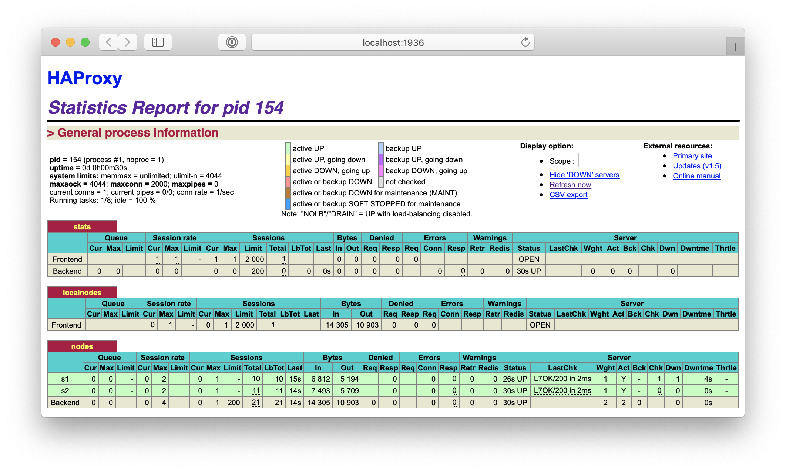
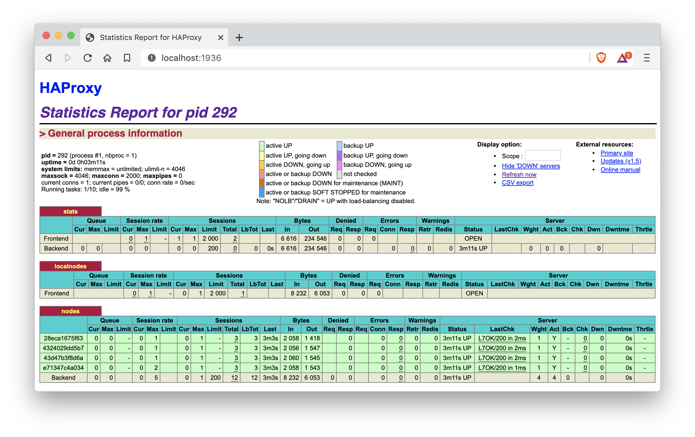
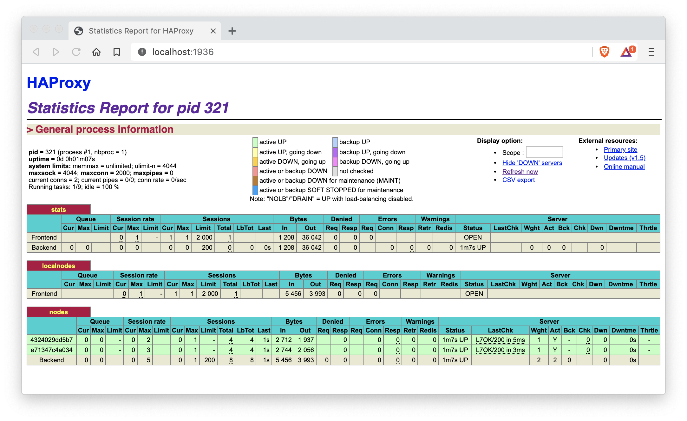
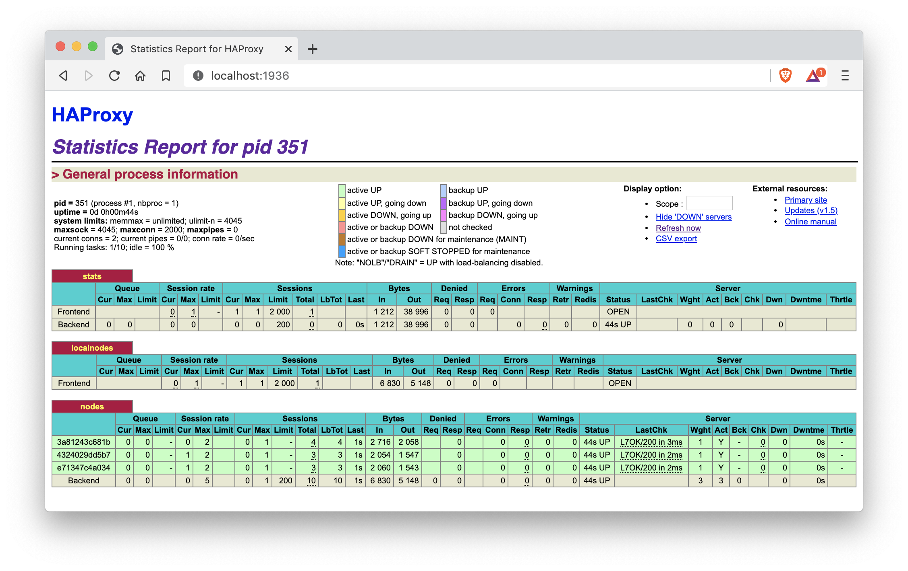

# Lab 04 – Docker

* **Date**: 04.12.2019
* **Auteurs**: Nikolaos Garanis, Samuel Mettler.
* **Repository**: <https://github.com/nyg/Teaching-HEIGVD-AIT-2019-Labo-Docker>

## Summary

- [Lab 04 – Docker](#lab-04-%e2%80%93-docker)
  - [Summary](#summary)
  - [Introduction](#introduction)
  - [Task 0: Identify issues and install the tools](#task-0-identify-issues-and-install-the-tools)
  - [Task 1: Add a process supervisor to run several processes](#task-1-add-a-process-supervisor-to-run-several-processes)
  - [Task 2: Add a tool to manage membership in the web server cluster](#task-2-add-a-tool-to-manage-membership-in-the-web-server-cluster)
  - [Task 3: React to membership changes](#task-3-react-to-membership-changes)
  - [Task 4: Use a template engine to easily generate configuration files](#task-4-use-a-template-engine-to-easily-generate-configuration-files)
  - [Task 5: Generate a new load balancer configuration when membership changes](#task-5-generate-a-new-load-balancer-configuration-when-membership-changes)
  - [Task 6: Make the load balancer automatically reload the new configuration](#task-6-make-the-load-balancer-automatically-reload-the-new-configuration)
  - [Difficulties found](#difficulties-found)
  - [Conclusion](#conclusion)

## <a name="introduction"></a>Introduction

In this laboratory we are going to study the configuration of HAProxy and other component to see how we could implement a good cluster. We will be working with two nodes and HAProxy. We will be looking at how docker is working internally and discover more about docker layer. A `gossip protocol` will be studied and implemented to have a cluster with autodiscovery by the end of this laboratory.


## <a name="task-0"></a>Task 0: Identify issues and install the tools

Screenshot of the HAProxy statistics page.


> **[M1] Do you think we can use the current solution for a production environment? What are the main problems when deploying it in a production environment?**

The main problem is that if a node goes down (or the load balancer itself), there is no supervisor that will bring them up again (or start new ones). Another issue is that, as we can see in the next question, adding another node is pretty cumbersome and cannot be done dynamically.

> **[M2] Describe what you need to do to add new webapp container to the infrastructure. Give the exact steps of what you have to do without modifiying the way the things are done. Hint: You probably have to modify some configuration and script files in a Docker image.**

We must add two environment variables in the `.env` file:

```
WEBAPP_3_NAME=s3
WEBAPP_3_IP=192.168.42.33
```

Then we must add a new service in the `docker-compose.yml` file and add the two new environment variables to the haproxy service:

```
webapp3:
  container_name: ${WEBAPP_3_NAME}
  build:
    context: ./webapp
    dockerfile: Dockerfile
  networks:
    public_net:
      ipv4_address: ${WEBAPP_3_IP}
  ports:
    - "4002:3000"
  environment:
    - TAG=${WEBAPP_3_NAME}
    - SERVER_IP=${WEBAPP_3_IP}

haproxy
  ...
  environment:
    ...
    - WEBAPP_3_IP=${WEBAPP_3_IP}
```

We must add a third node in the `haproxy.cfg` file:

```
backend nodes
	server s3 ${WEBAPP_3_IP}:3000 check
```

In the `run-daemon.sh` and `run.sh` we must also add a line to handle the new node:

```sh
sed -i 's/<s3>/$S3_PORT_3000_TCP_ADDR/g' /usr/local/etc/haproxy/haproxy.cfg
```

> **[M3] Based on your previous answers, you have detected some issues in the current solution. Now propose a better approach at a high level.**

A better approach would be for the load balancer to automatically detect new  nodes that are available and ready to receive requests. I would also be interesting to have a kind of supervisor that will detect if a node is down and if that happens start a new one.

> **[M4] You probably noticed that the list of web application nodes is hardcoded in the load balancer configuration. How can we manage the web app nodes in a more dynamic fashion?**

We could define a protocol where a node can broadcast its availability. When the load balancer detects a new node that is available, it will consider it when doing load balancing.

> **[M5] In the physical or virtual machines of a typical infrastructure we tend to have not only one main process (like the web server or the load balancer) running, but a few additional processes on the side to perform management tasks.**
>
> **For example to monitor the distributed system as a whole it is common to collect in one centralized place all the logs produced by the different machines. Therefore we need a process running on each machine that will forward the logs to the central place. (We could also imagine a central tool that reaches out to each machine to gather the logs. That's a push vs. pull problem.) It is quite common to see a push mechanism used for this kind of task.**
>
> **Do you think our current solution is able to run additional management processes beside the main web server / load balancer process in a container? If no, what is missing / required to reach the goal? If yes, how to proceed to run for example a log forwarding process?**

We would need to update the Dockerfile of each node so this additional management process is started. We would also need to define specifically how the different instances of the process will communicate between each other.

> **[M6] In our current solution, although the load balancer configuration is changing dynamically, it doesn't follow dynamically the configuration of our distributed system when web servers are added or removed. If we take a closer look at the `run.sh` script, we see two calls to `sed` which will replace two lines in the `haproxy.cfg` configuration file just before we start HAProxy. You clearly see that the configuration file has two lines and the script will replace these two lines.**
>
> **What happens if we add more web server nodes? Do you think it is really dynamic? It's far away from being a dynamic configuration. Can you propose a solution to solve this?**

We need to add more lines as mentionned in the M2 question. One solution would be to add all possible IP in the configuration file. HAProxy will consider most of them down, but this is not a problem as long as it can detect when a new node is started. But this is not a very solution because HAProxy will send HEAD requests for all IPs, which is a waste of resources.

## <a name="task-1"></a>Task 1: Add a process supervisor to run several processes

> 1. **Take a screenshot of the stats page of HAProxy at  <http://192.168.42.42:1936>. You should see your backend nodes. It should be really similar to the screenshot of the previous task.**



> 2. **Describe your difficulties for this task and your understanding of what is happening during this task. Explain in your own words why are we installing a process supervisor. Do not hesitate to do more research and to find more articles on that topic to illustrate the problem.**

The life of a Docker container is tied to the life of the process which we start (e.g. haproxy, node) when creating the container. If this process stops, the container will also stop. This is called the entrypoint of the container. What we have done in this task is to replace this entrypoint by another process called S6 which gives us the ability to start and stop other processes in the container, without the container being stopped. For the moment, we have only told S6 to start either node or haproxy, depending on the Docker image.

S6 will allow us to start a supervisor in each container which will report on the status of the "main" process (i.e. haproxy and node).

## <a name="task-2"></a>Task 2: Add a tool to manage membership in the web server cluster

> 1. **Provide the docker log output for each of the containers: `ha`, `s1` and `s2`.**

There are two folders in the `logs/task-2` folder:
* `order-ha-s1-s2` contains the logs of ha, s1, s2 when started in this order,
* `order-s1-s2-ha` contains the logs of s1, s2, ha when started in this order.

> 2. **Give the answer to the question about the existing problem with the current solution.**

The problem with the current solution is that depending on which order we launch each container it won't work properly. If we start `s1` and `s2` before ha they won't join the cluster

> 3. **Give an explanation on how `Serf` is working. Read the official website to get more details about the `GOSSIP` protocol used in `Serf`. Try to find other solutions that can be used to solve similar situations where we need some auto-discovery mechanism.**

"Serf is a tool for cluster membership, failure detection, and orchestration that is decentralized, fault-tolerant and higly available" ([source](https://www.serf.io/intro/index.html)). Serf uses an upgraded version of SWIM (Scalable Weakly-consistent Infection-style Process Group Membership Protocol) which they upgraded themself to increase propagation speed and convergence rate. 

**What does it really means ?** Serf keeps an up to date cluster membership list and is able to execute custom scripts when this list changes. A script could be to notify a load balancer when a web server is going down (or going up again). This implies that Serf detects failed nodes withing a short amount of time and can notify the rest of the cluster. Serf will attempt after a node went down to reconnect to this node every X time. Since Serf can broadcast custom events Serf is really flexible and conveniant.

**What is the Gossip Protocol ?** The Gossip Protocol is how all nodes in a cluster are communicating. This protocol is named that way because of how the failure detection is done. If a node fails to ack within a certain amount of time all other node will try to contact the failing node. If the failing node still doesn't reply the node will be marked as "suspicious" and this information will be gossiped to the whole cluster. A "suspicious" node will still be considered a member of the cluster. However if this node doesn't contest its status within a configurable amount of time it will be considered dead and then again, this information will be gossiped to the cluster.

Gossip is done over UDP over a fixed fanout and interval. Each node will send to another random node and exchange all his informations in order to spread the gossip. Complete state changes can also be done using TCP but are much less used than the traditionnal Gossip over UDP.

**Serf versus other solutions :** ZooKeeper, doozerd and etcd are solutions which have a different implementation than Serf. They are however much more complex to use. They need to use librairies on top of their implementation in order to build the features they need. Additionnaly Serf is not mutually exclusive with any of these strongly conistent systems and can be combined to create a more scalable and fault tolerant implementation.

Serf can also be compared to some configuration management tools such as Chef and Puppet that also provide a way to do a similar work than Serf. For example if you generate a config file for a load balancer to include the web servers it will be used to manage membership. However such practice isn't recommended since those tools are not designed to propagate information quickly, handle failure detection or tolerate network partitions. Once again, Serf can be use with such tools to improve global efficiency.

Another solution worth mentionning is Consul. Consul is a tool for service discovery and configuration which provides high level features such as service discovery, health checking and key/value storage. Consul is using a centralized server to manage the datacenter (where Serf isn't). Consul is providing los of high-level features which is only implemented in Serf as low-level features. Consul internal gossip protocol is built on the Serf librairy and they extended it in a way to improve it.

[source](https://www.serf.io/intro/vs-other-sw.html)

## <a name="task-3"></a>Task 3: React to membership changes

> 1. **Provide the docker log output for each of the containers:  `ha`, `s1` and `s2`. Put your logs in the `logs` directory you created in the previous task.**

Provided in the logs folder:
* ha-docker-run.log,
* s1-docker-run.log,
* s2-docker-run.log,
* ha-after-s1-s2.log.

> 2. **Provide the logs from the `ha` container gathered directly from the `/var/log/serf.log` file present in the container. Put the logs in the `logs` directory in your repo.**

Provided in the logs folder:
* serf.log

## <a name="task-4"></a>Task 4: Use a template engine to easily generate configuration files

> 1. **You probably noticed when we added `xz-utils`, we have to rebuild the whole image which took some time. What can we do to mitigate that? Take a look at the Docker documentation on [image layers](https://docs.docker.com/engine/userguide/storagedriver/imagesandcontainers/#images-and-layers). Tell us about the pros and cons to merge as much as possible of the command**

Everytime you write a new line (a command) in a dockerfile it adds a new layer to the image. Each new `layer` correspond to the filesystem change of the image before and after the new command. This is a really important point to consider since each image will be stored somewhere and consume disk storage so in order to reduce the space consumption, when you are working on the same file you should do it in the same command (example :  download source code, extract it, compile it into a binary, and then delete the tgz and source files at the end). Otherwise, if you are doing it in different command (for instance deleting the tgz in a another run command) the file will still be stored on the first layer and then deleted on the second so the resulting filesystem will be without it.

The second thing to consider is `layer caching`. Docker uses a `layer cache` to optimize the process of building images (meaning to make it faster). The first time each layer is build docker also create a layer cache that will be used the next time a build is make. Therefore if nothing as been change on the previous commands docker won't build them a second time but will use the "cached" layer. This is mostly true for the `RUN`. However, docker will check everytime that there is a `COPY` and `ADD` command that the file is either up to date. If it is docker will use once again the cached layer, otherwise if the content if different than all subsequent commands will be executed without using the layer cache. This behavior implies that every component that will be updated very rarely should be high up in the Dockerfile and in the other hand that command that may change frequently should be put at the end of the dockerfile.

`squashing` is an option available during the build. Once the build is complete, Docker creates a new image loading all the differences from each layer into a single new layer. Docker also create cached layer to each individual layer to accelerate next build.

`flattening` has the same goal, create a single resulting layer from an image that could have been build with multiple layer, to do so, simply run `docker export <image> | docker import <resulting image>` 

> 2. **Propose a different approach to architecture our images to be able to reuse as much as possible what we have done. Your proposition should also try to avoid as much as possible repetitions between your images.**

What we could do to avoid repetitions between our images is to make all commands present on the both side at first and then do the specific commands later. It means to make them inherit from the same image and then installing all required packages (all `apt install/get`, `serf`, `s6`) and later specific command. This way because of how docker images are working the install of the second image will be much faster.

> 3. **Provide the `/tmp/haproxy.cfg` file generated in the `ha` container after each step.  Place the output into the `logs` folder like you already did for the Docker logs in the previous tasks. Three files are expected. In addition, provide a log file containing the output of the `docker ps` console and another file (per container) with `docker inspect <container>`. Four files are expected.**

Provided in the logs folder.

> 4. **Based on the three output files you have collected, what can you say about the way we generate it? What is the problem if any?**

The problem is that each time a new node is connecting to the cluster the output file (the file that logs the connexions) is overwritten and only the ip of the last node who joined the cluster is reported. Therefore we can't keep a good log file and that's not really good.

## <a name="task-5"></a>Task 5: Generate a new load balancer configuration when membership changes

> 1. **Provide the file `/usr/local/etc/haproxy/haproxy.cfg` generated in the `ha` container after each step. Three files are expected. In addition, provide a log file containing the output of the `docker ps` console and another file (per container) with `docker inspect <container>`. Four files are expected.**

Provided in the logs folder:
* haproxy.cfg,
* haproxy-after-s1.cfg,
* haproxy-after-s2.cfg,
* docker-ps.log,
* docker-inspect-ha.log,
* docker-inspect-s1.log,
* docker-inspect-s2.log.

> 2. **Provide the list of files from the `/nodes` folder inside the `ha` container. One file expected with the command output.**

Provided in the logs folder (nodes.txt).

> 3. **Provide the configuration file after you stopped one container and the list of nodes present in the `/nodes` folder. One file expected with the command output. Two files are expected. In addition, provide a log file containing the output of the `docker ps` console. One file expected.**

Provided in the logs folder:
* nodes-after-kill-s1.txt,
* haproxy-after-kill-s1.cfg,
* docker-ps-after-kill-s1.log.

## <a name="task-6"></a>Task 6: Make the load balancer automatically reload the new configuration

> 1. **Take a screenshots of the HAProxy stat page showing more than 2 web applications running. Additional screenshots are welcome to see a sequence of experimentations like shutting down a node and starting more nodes.**

At first we started 4 nodes in addition to the ha backend.



Then we killed two nodes (s1 and s2).



Finally, we started a new node (s5).



> **Also provide the output of `docker ps` in a log file. At least one file is expected.**

Provided in the logs folder (task-6).

> 2. **Give your own feelings about the final solution. Propose improvements or ways to do the things differently. If any, provide references to your readings for the improvements.**

This solution seems to be a good way of implementing a cluster with autodiscovery of nodes however it wasn't that easy to configure everything as we wanted. It could probably be better but it gets the job done.

## <a name="difficulties"></a>Difficulties found

The configuration was quite heavy and we weren't sure of what we were doing until the end where everything comes together. Also it wasn't really clear to us whether we were supposed to use `docker-compose` or `docker run`.

## <a name="conclusion"></a>Conclusion

This laboratory has helped us better understand how to deal with cluster management when we're using a auto discovery protocol such as Serf. We also learned about the different protocol that could also provides a `gossip protocol` and how they operate withing a given cluster. We also learned more about `haproxy`.