# Lab 03 – Load balancing

* **Date** : 25.11.2019
* **Auteurs** : Nikolaos Garanis, Samuel Mettler.

## Introduction

In this laboratory we are going to study the configuration of HAProxy, in order to see how its load balancer mode functions (and which methods can be used). Using two session-based applications, we will also see how HAProxy can handle application sessions when there are multiple servers. We are also going to test how HAProxy deals with servers when they are under heavy load.

## Task 1: Install the tools

> 1. **Explain how the load balancer behaves when you open and refresh the URL <http://192.168.42.42> in your browser. Add screenshots to complement your explanations. We expect that you take a deeper a look at session management.**

Whenever we are refreshing the URL, we can observe that each time we are answered by a different server (first s1, then s2, then s1 again, ect..). As we search into the parameters files we can easily explain this.

Here is the nodes configuration in `haproxy.cfg`:
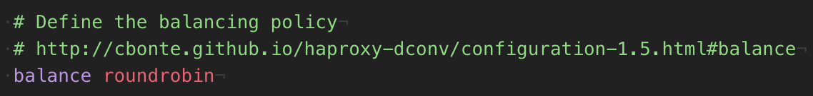

The weight value is not defined so it is 1 by default for both nodes:
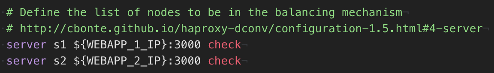

Round robin balancing : client requests are routed to available servers on a cyclical basis. This cyclical basis is defined by a parameter call "weight" : once x requests has been handle (x being the weight) the load balancer will route new requests to the next server. Here the weight being 1 (by default) each time a client resquest occures, the next one will be routed to the other server.

> 2. **Explain what should be the correct behavior of the load balancer for session management.**

The correct way to implement a load balancer for session management is the following : The first time the client connects to the website he'll receive a session ID (a unique token) that identifies him to the server. After that, for each request from the same client the load balancer redirects the request to the same server where data is stored and updated.

If we use a round robin load balancer with session management this is how each new client will be treated :

1. A user's first request is routed to a web server using the regular round robin algorithm (explained in Q1)
2. User's next requests are then forwarded to the same server until the sticky session expires 
3. When the sticky session expires the next request from this client will be treated the same way as a user's first request. (Continual loop)

> 3. **Provide a sequence diagram to explain what is happening when one requests the URL for the first time and then refreshes the page. We want to see what is happening with the cookie. We want to see the sequence of messages exchanged (1) between the browser and HAProxy and (2) between HAProxy and the nodes S1 and S2.**

Because HAProxy doesn't care about cookies (no `cookie` in the `backend` section of `haproxy.cfg`), when a client requests the URL, HAProxy redirects him to the first node, the first node returns a cookie with a new session id (because the client has none). When the client refreshes the page, HAProxy will forward the request to the second node (because of the roundrobin policy). The second node will check the session id in the cookie but will not recognize it (because it was created by the first node), so it will create a new session and return it in a new cookie. The same thing will happen if the user refreshes the page again, the first node will not recognize the second node's session id, so it will create a new one, and so on.

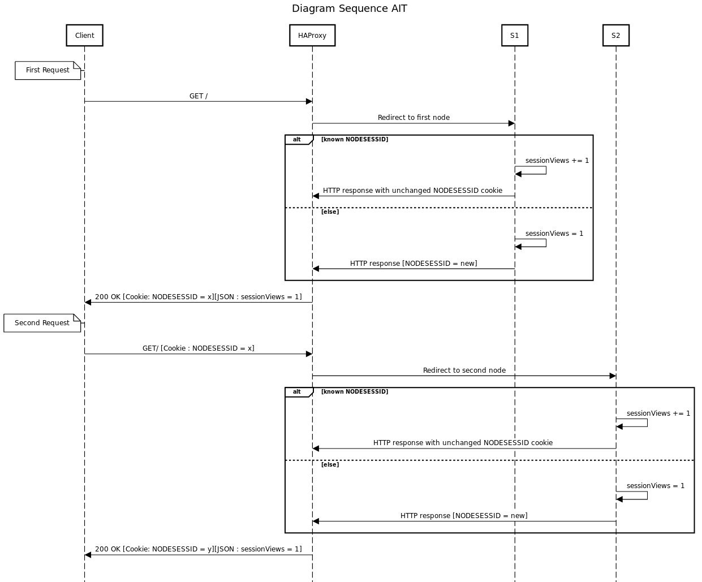

> 4. **Provide a screenshot of the summary report from JMeter.**


> 5. **Clear the results in JMeter and re-run the test plan. Explain what is happening when only one node remains active. Provide another sequence diagram using the same model as the previous one.**

We can see that when we shutdown one of the node, HAProxy adapts itself and will send all the requests to the remaining running node. In fact, HAProxy continuously sends HEAD requests to the nodes to check if they are alive, this is how it detected that `s1` was down (this is defined in `haproxy.cfg` with `option httpchk HEAD /`).

What happens when s1 is shutdown:
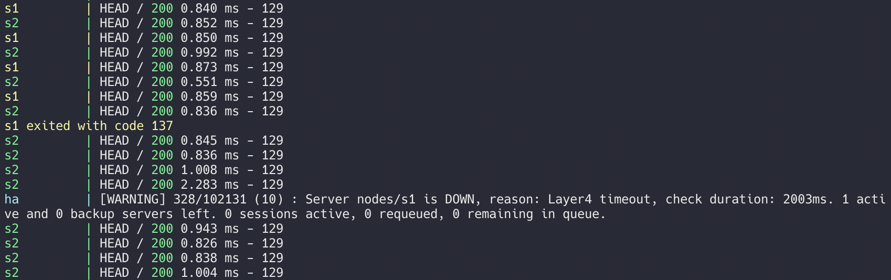

Here is the summary report when we relaunched the JMeter test:


Here is the sequence diagram:


## Task 2: Sticky sessions

> 1. **There is different way to implement the sticky session. One possibility is to use the SERVERID provided by HAProxy. Another way is to use the NODESESSID provided by the application. Briefly explain the difference between both approaches (provide a sequence diagram with cookies to show the difference).**

The difference between the two options is the following: when using the SERVERID cookie we will have in total 2 cookies (SERVERID & NODESESSID) ; when using the NODESESSID (which is the application cookie) we will have only one cookie (and its value will be prefixed with a value to identify the server on which the session was created). For the rest of the lab, we chose to reuse the application cookie (NODESESSID).

Also, it is important to note that the prefixed value (in NODESESSID) or the SERVERID cookie is not transmitted to any of the application node. It's a value that is exchanged only between the client and the proxy.

Here is the sequence diagram of what is happening:


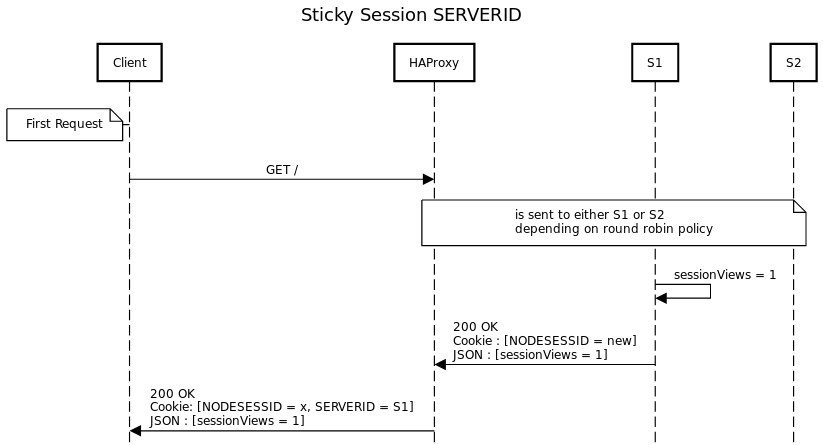

> 2. **Provide the modified `haproxy.cfg` file with a short explanation of the modifications you did to enable sticky session management.**

The modifications we made are the following:
1. First, we need to enable the cookie-based persistence in the backend, we do that with the third line (see below). We tell HAProxy to reuse NODESESSID and that it should prefix a given value to the value of the NODESESSID cookie. This value will depend on the node the request will be forwarded to.
2. Next, we need to specify what this value will be for each server. For that we append `cookie <value>` to the `server` configuration line (see line 1 and 2 below).

Here we show only the modified lines of the configuration file:
```
server s1 ${WEBAPP_1_IP}:3000 check cookie s1
server s2 ${WEBAPP_2_IP}:3000 check cookie s2
cookie NODESESSID prefix
```

> 3. **Explain what is the behavior when you open and refresh the URL <http://192.168.42.42> in your browser. Add screenshots to complement your explanations. We expect that you take a deeper a look at session management.**

In the following two screenshot we show the usage of the NODESESSID (the method we have chosen). In the first request, the client doesn't send any cookie, so the HAProxy chooses a node itself and will return the cookie prefixed with the node identifier (`s1~`). In the second request, the client sends the cookie, so the HAProxy will know which node to contact. The HAProxy will not send the cookie again as it has not been modified.

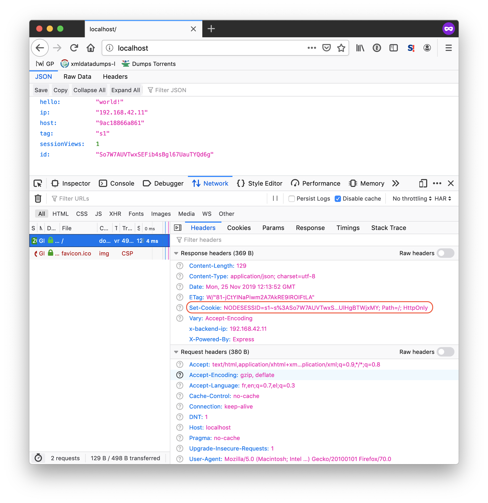
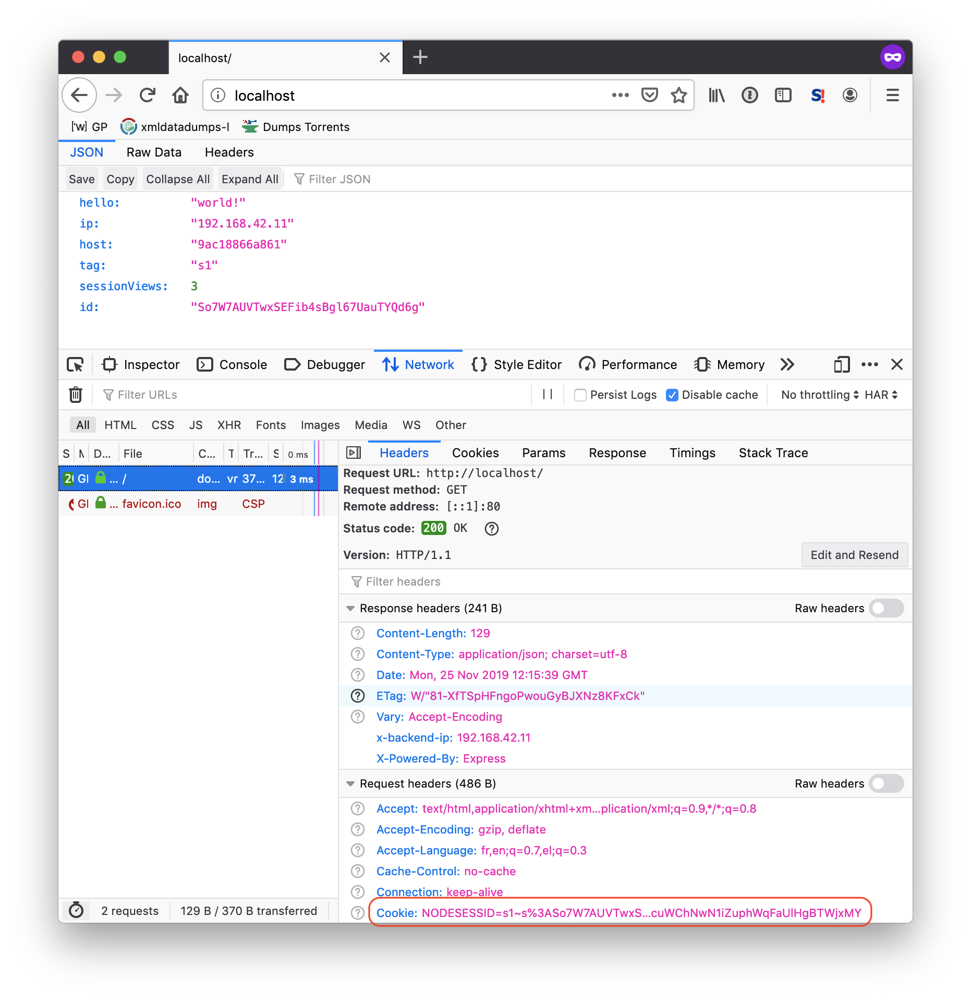

> 4. **Provide a sequence diagram to explain what is happening when one requests the URL for the first time and then refreshes the page. We want to see what is happening with the cookie. We want to see the sequence of messages exchanged (1) between the browser and HAProxy and (2) between HAProxy and the nodes S1 and S2. We also want to see what is happening when a second browser is used.**

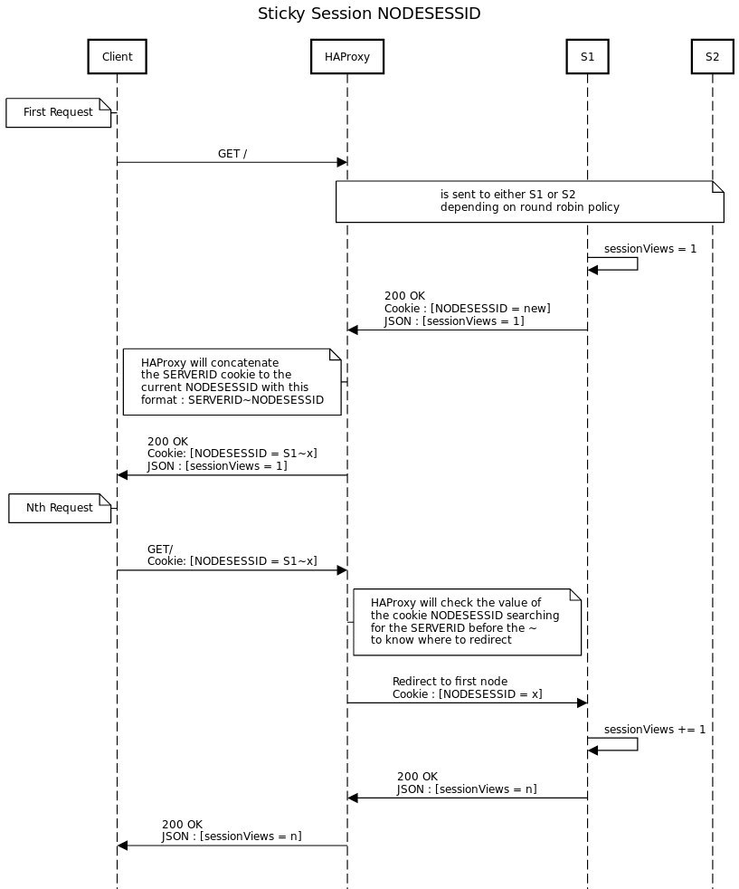
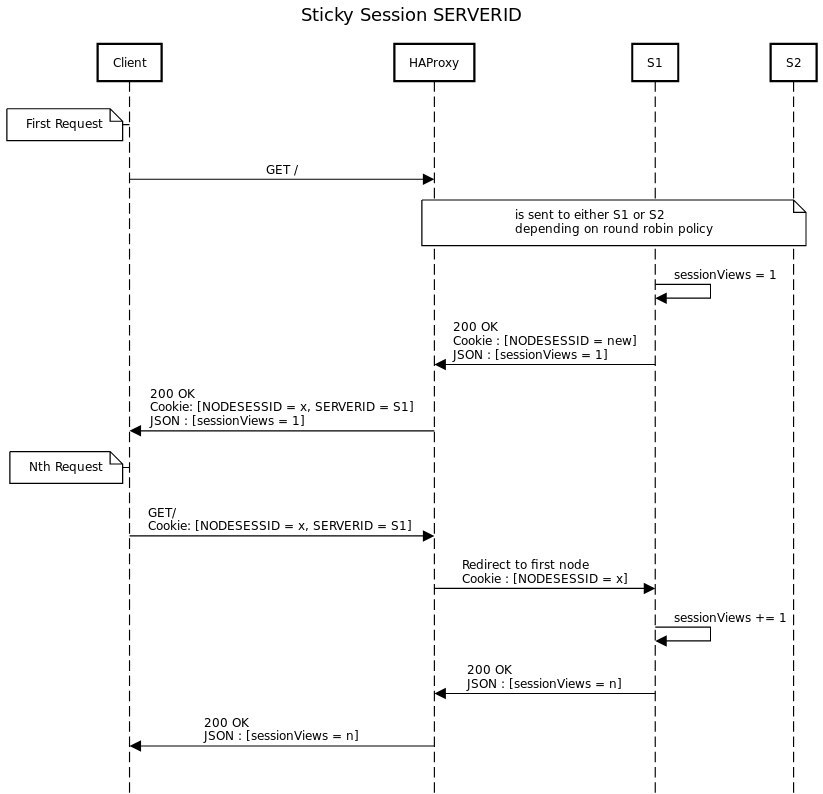

> 5. **Provide a screenshot of JMeter's summary report. Is there a difference with this run and the run of Task 1?**

Here is the summary when the cookie are **not** cleared between each requests. We see that the behavior is different from the task 1 : only one node is reached. In our case, s1 was reached but it could have been s2 as well.

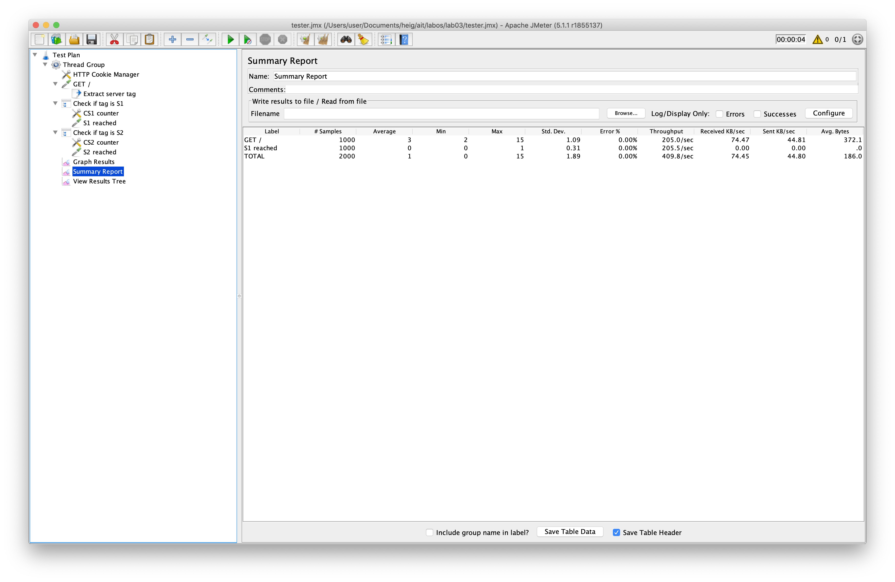

> 6. **Provide a screenshot of JMeter's summary report. Give a short explanation of what the load balancer is doing.**

We now repeat the JMeter test but we clear cookies between each requests and we use two threads. As the cookies are clear for each request, for the HAProxy, it's like we have only one client so the roundrobin policy applies, and we have 1,000 requests sent to one node, and 1,000 requests sent to the other node. We have a total of 2,000 requests because we have two threads.


## Task 3: Drain mode

> 1. **Take a screenshot of the Step 5 and tell us which node is answering.**

We can see that the first node (s1) is answering:
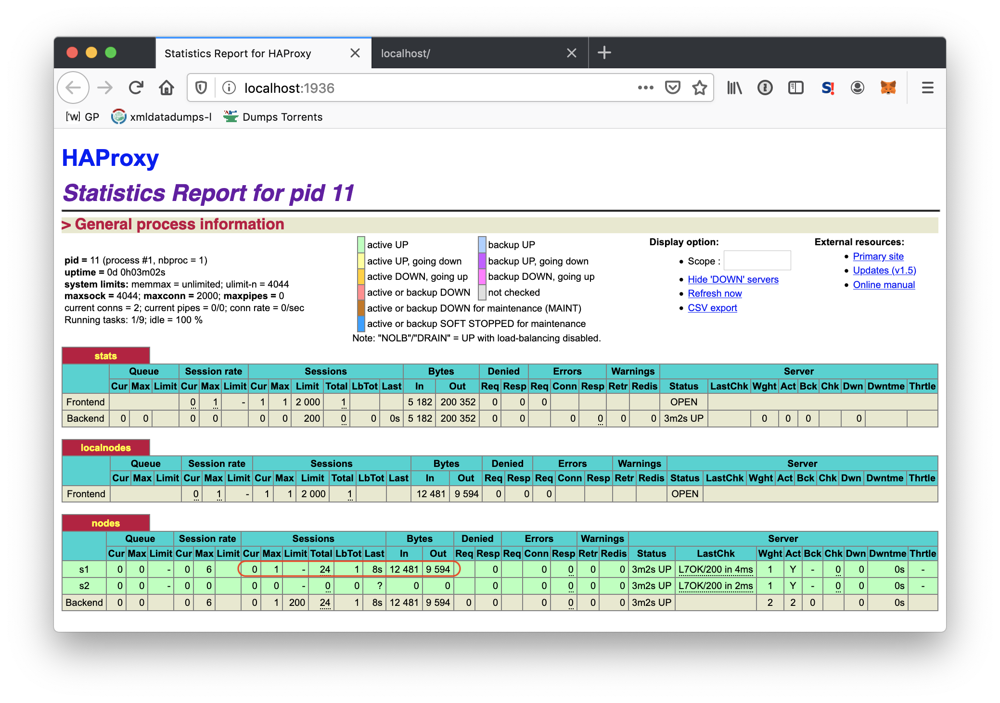

> 2. **Based on your previous answer, set the node in DRAIN mode. Take a screenshot of the HAProxy state page.**

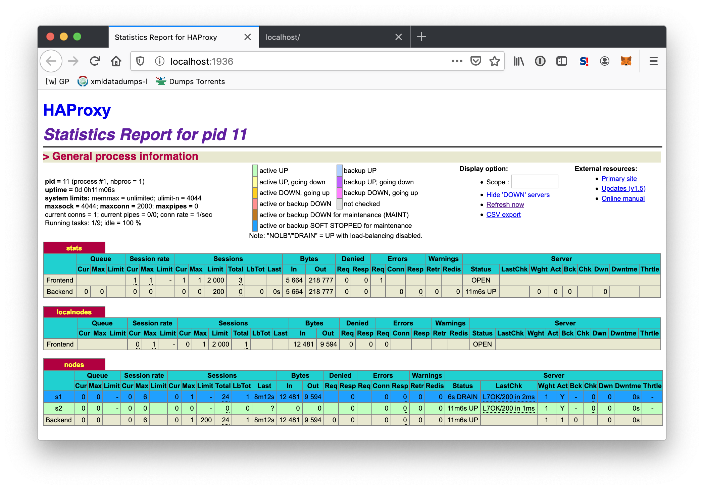

> 3. **Refresh your browser and explain what is happening. Tell us if you stay on the same node or not. If yes, why? If no, why?**

Yes, we are staying on the same node because this is the definition of the drain mode. Active session can still go the drained node (and refreshing the page means that we are using the same session) but all new requests will be redirected to the second node.

> 4. **Open another browser and open `http://192.168.42.42`. What is happening?**

We are redirected to the second node:
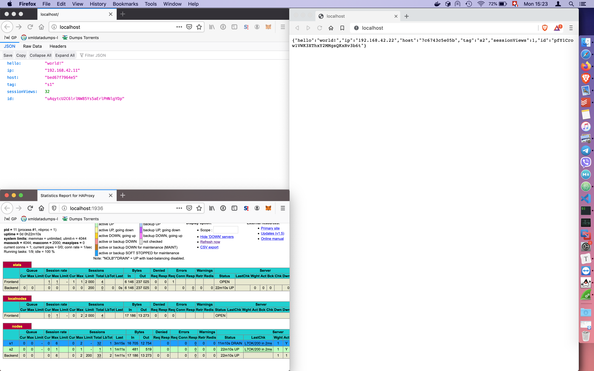

> 5. **Clear the cookies on the new browser and repeat these two steps multiple times. What is happening? Are you reaching the node in DRAIN mode?**

No, we are not reaching the drain mode, because only new sessions are created.
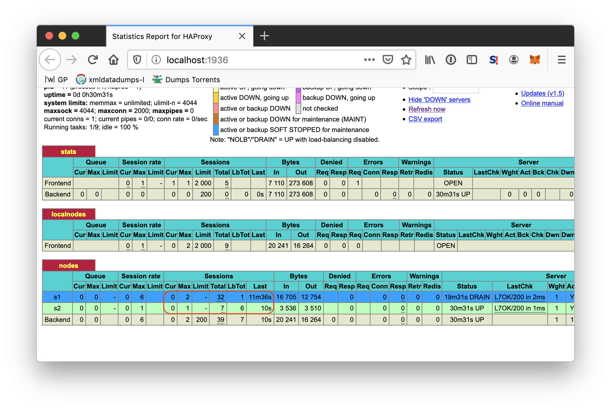

> 6. **Reset the node in READY mode. Repeat the three previous steps and explain what is happening. Provide a screenshot of HAProxy's stats page.**

3. When we refresh the page, the request will be forwarded to the node that was already in use by the session.
4. When opening a new browser (so new session), we are redirected to a new node, chosen according to the roundrobin policy.
5. Same as 4., when there are no cookies, the HAProxy chooses the node according to the roundrobin policy.

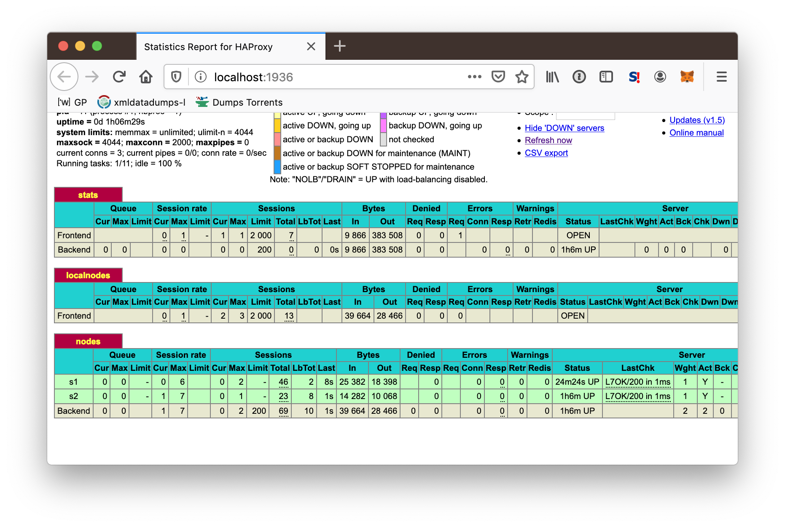

> 7. **Finally, set the node in MAINT mode. Redo the three same steps and explain what is happening. Provide a screenshot of HAProxy's stats page.**

The difference here is that when we refresh the page of a session associated to s1, HAProxy will redirect to s2 (and not to s1 like in drain mode). In the screenshot we can see that the refresh of the page associated with s1 redirected us to a session associated to s2.

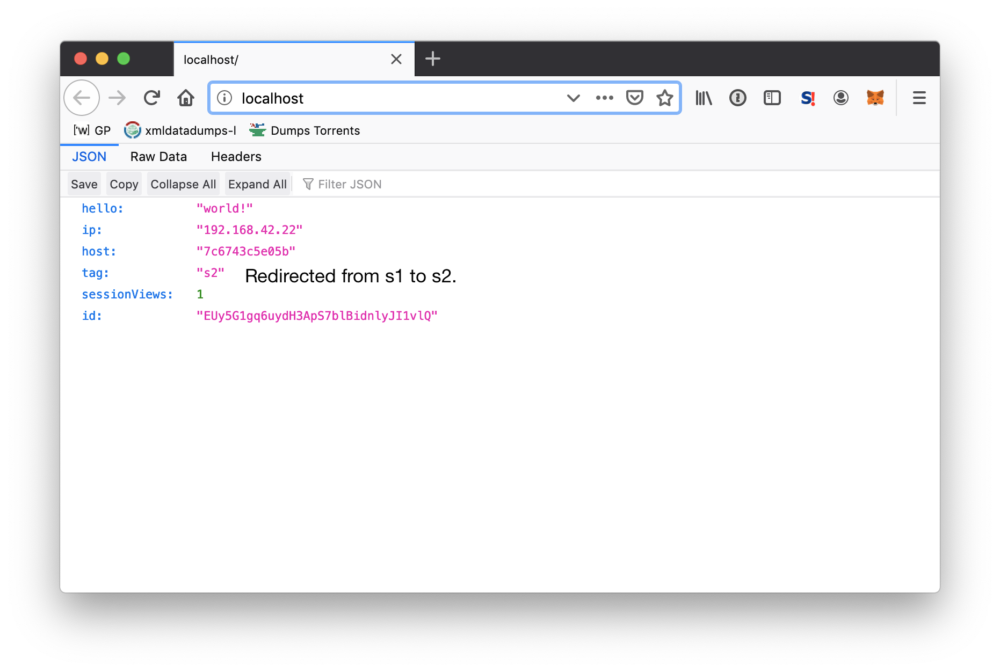
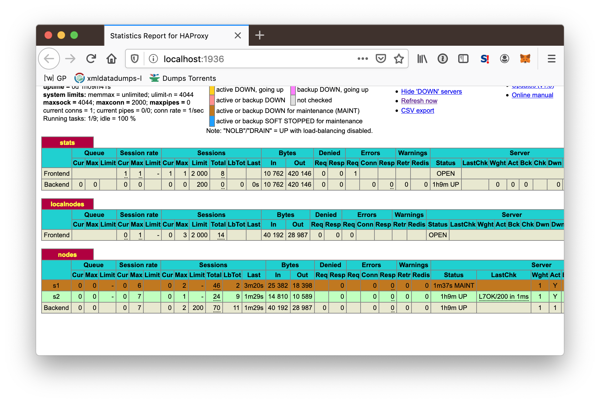

## Task 4: Round robin in degraded mode.

> 1. **Be sure the delay is of 0 milliseconds is set on `s1`. Do a run to have base data to compare with the next experiments.**

This is the base data on which we will compare our next experiments :
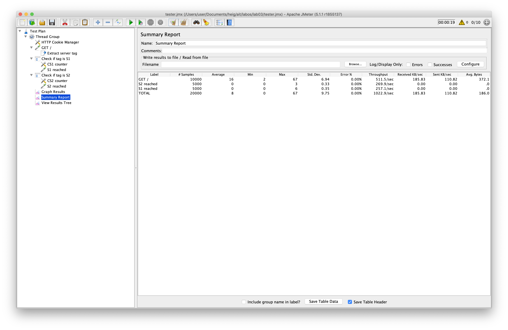

> 2. **Set a delay of 250 milliseconds on `s1`. Relaunch a run with the JMeter script and explain what it is happening?**

In order to set the delay to 250 ms on `s1` we ran the following command :
```sh
curl -H "Content-Type: application/json" -X POST -d '{"delay": 250}' \   
http://localhost:4000/delay
```
As soon as we did the command we have the confirmation the request has been made. We can see that the post request is made (and returned OK) and also that the following answers from s1 took aroung 255ms :

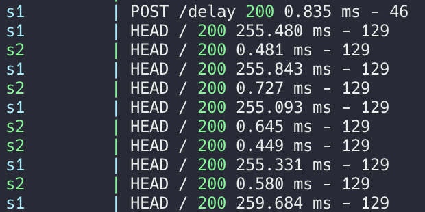

Results of our JMeter :


We can see that they will execute 5000 requests on both server. However as expected S2 will handle all his requests way faster then S1. S1 is handling around 3.6 request by second which is totally normal since one request is taking around 0.255 seconds to be answered.  

> 3. **Set a delay of 2500 milliseconds on `s1`. Same than previous step.**

To change the delay we did :
```sh
curl -H "Content-Type: application/json" -X POST -d '{"delay": 2500}' \
     http://localhost:4000/delay
```

We also have the confirmation that the request has been made :

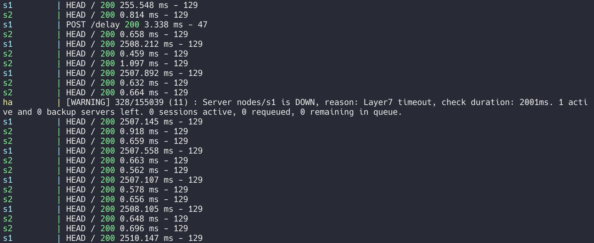

We can observe that `s1` is taking around 2.5 seconds to answer. Since the timeout on HAProxy is 2 seconds it will be considered down even if we actually reply to the HEAD. Quite ironic isn't it ?

The JMeter test will then consider `s1` as down so will only send request to `s2` :


Since `s1` is considered down, all requests will be forwarded to `s2`. However if we were fast enough it would have been possible to also send some requests to `s1` if we launched JMeter's tests before `s1` were considered down (approximatively 5 seconds after the `POST` request). 

> 4. **In the two previous steps, are there any error? Why?**

There is no error in the step 2, however there is one warning from HAProxy on step 3. This is caused by the fact that since the server is taking over 2 seconds to answer, HAProxy will assume that the server is down therefore won't forward any request to `s1`.

> 5. **Update the HAProxy configuration to add a weight to your nodes. For that, add `weight [1-256]` where the value of weight is between the two values (inclusive). Set `s1` to 2 and `s2` to 1. Redo a run with 250ms delay.**


In order to change the weight do the following change in `haproxy.cfg` :
```
server s1 ${WEBAPP_1_IP}:3000 check cookie s1 weight 2
server s2 ${WEBAPP_2_IP}:3000 check cookie s2 weight 1
```
Because of the round robin policy, seven sessions will be associated to s1 and 3 to s2 (we have 10 threads). The pattern will be the following: `s1` - `s1` - `s2` - `s1` - `s1` - `s2`- `s1` - `s1` - `s2` - `s1`. This is why we have 700 requests going to s1, and 300 to s2 (we have reduced the number of requests from 1,000 to 100).

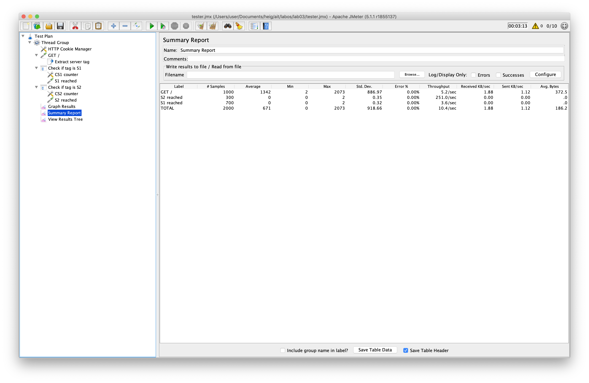

> 6. **Now, what happened when the cookies are cleared between each requests and the delay is set to 250ms ? We expect just one or two sentence to summarize your observations of the behavior with/without cookies.**

When we clear the cookies for each request, we expected to get around 667 requests for s1 and 333 for s2, but instead, as HAProxy is trying to respect the weights we assigned the nodes, s1 goes down at one point (it takes more than 2 seconds for it to respond) and so all the remaining requests end up going to s2.

The difference in question 5. is that each thread gets assign a node at the very beginning and it cannot change afterward.


## Task 5: Balancing strategies

> 1. **Briefly explain the strategies you have chosen and why you have chosen them.**

The first strategy we have chosen is `uri`. We chose it because according to the documentation it is designed specifically for HTTP backends. Also, some websites forward URIs to different servers. For example, `/api` could go to server A and `/home` to server B. This is why we wanted to experiment with this strategy.

The second strategy we have chosen is `first`. We chose it because according to the documentation it is a nice way to allow one of your server to be down (for maintenance or just to limit the energy consumption) while the other one is handling the requests.

> 2. **Provide evidences that you have played with the two strategies (configuration done, screenshots, ...)**

### Balance mode : URI 
For `uri` we have added an extra node (so we have s1, s2 and s3). We also did a minor modification to the backend application so an error is not returned when a request has a path in it (e.g. `/home`). For the HAProxy configuration, we removed the `cookie` in the `server` option and changed the `balance` option to `uri`. Note that these modifications were done on another branch (`fb-uri`). Some screenshots:

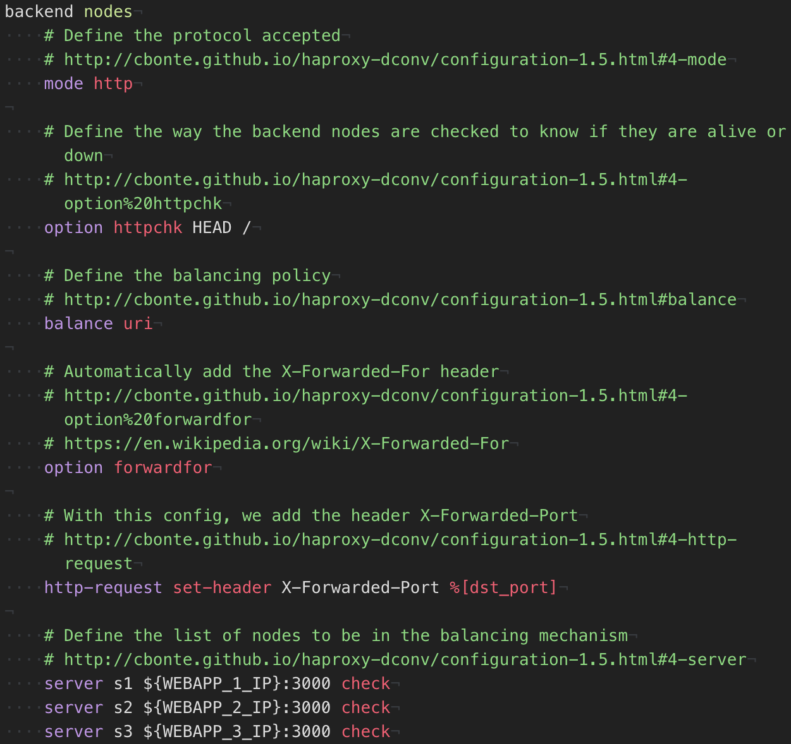


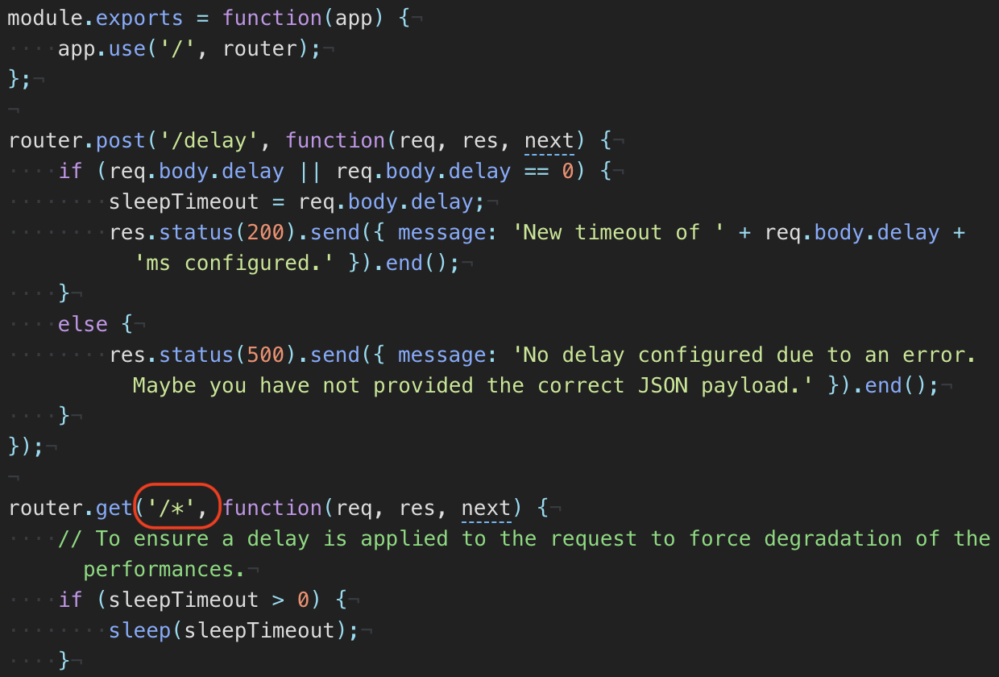

We then tested three different URIs (`/~jean.dupond`, `/~jeanpaul.francois` and `/~alfred.berthier`, they are stored in the `/user_paths.csv` file, and in JMeter we have added a CSV Data Set Config). We have three threads launching 100 requests. We can see each requests going to a different server.  But because the server chosen by HAProxy depends on the hash of the URI, we may have had different results (all paths going to the same server for example).

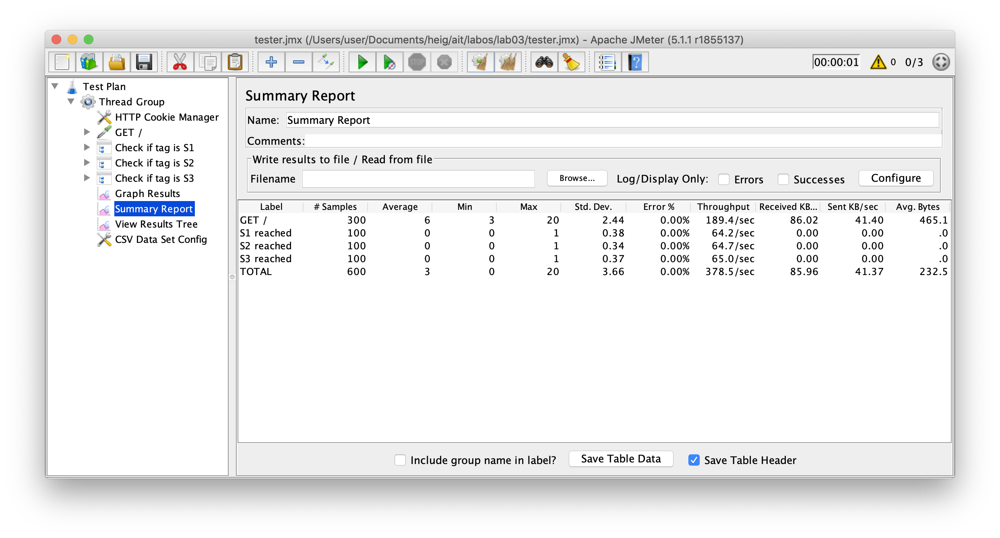

When then set the delay of the first node to 1.8 seconds and ran the same test with 6 threads launching 100 requests each. s1 went down and the other requests were properly redirected to the other two nodes.

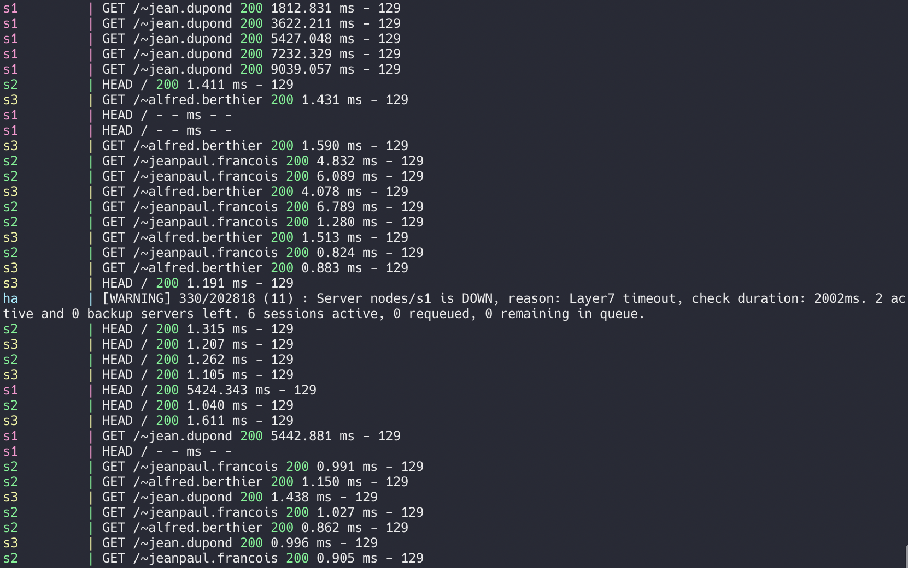

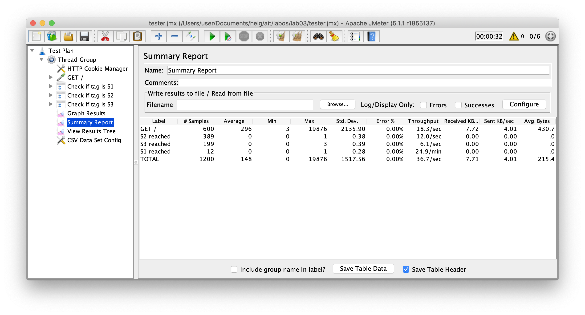

We can see that the 188 remaining requets of s1 went to s2. However we also have on request of s3 which went to s2 ($200 + 188 + 1 = 389$). This may have happened went s1 went down…

### Balande mode : First 

In order to set up the load balancer to `first` we have to write the following in `haproxy.cfg` :  
```
balance first
...
server s1 ${WEBAPP_1_IP}:3000 maxconn 2
server s2 ${WEBAPP_2_IP}:3000 maxconn 
```

We wanted to see how this would impact the tests whenever there is or isn't any delay. To do so we did one test with JMeter with a delay of 250ms on `s1` and this is the result :  

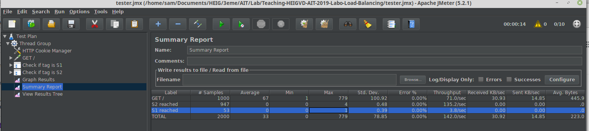  

What we are searching for is to see a big gap between the load of the 2 servers which is clearly the case here.  
We also tested without any delay :  
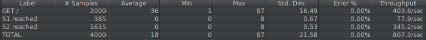

As expected `s1` is handling way less request than `s2`.


> 3. **Compare the both strategies and conclude which is the best for this lab (not necessary the best at all).**

`URI` is a really nice way to balance the load if there is enough used path in a server. However to be efficient we would like to have a website which has a more or less number of connection on each path, meaning that we would like to have for instance 50% of users connected on `/index` and 50% connected on `/home` so all servers would handle the same weight. A shop whose path change depending on which category of article the client is looking at would have a nice balance with `URI`.

`First` on the other hand is a much simpler balance. It only depends on one parameter which is the max allowed connection on a server at the same time. It's not as good as `URI` and if you start to use a lot of servers some of them can be never used and all the client would be split on the other servers. It's a good balancer for simple application with not a lot of server handling it.

In this lab we aren't using the URI (meaning that we aren't exploring any path) so it would be hardly interesting to use the `uri` balancing mode. Therefore using the `first` balacing mode would be better in our case because there are only 2 servers with the same path.

## Conclusion

This laboratory has helped us better understand how to deal with application sessions when we're using a load-balancer such as HAProxy. We also learned about the different load-balancing methods of HAProxy and how it deals with servers that take too much time to respond.