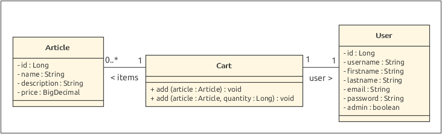
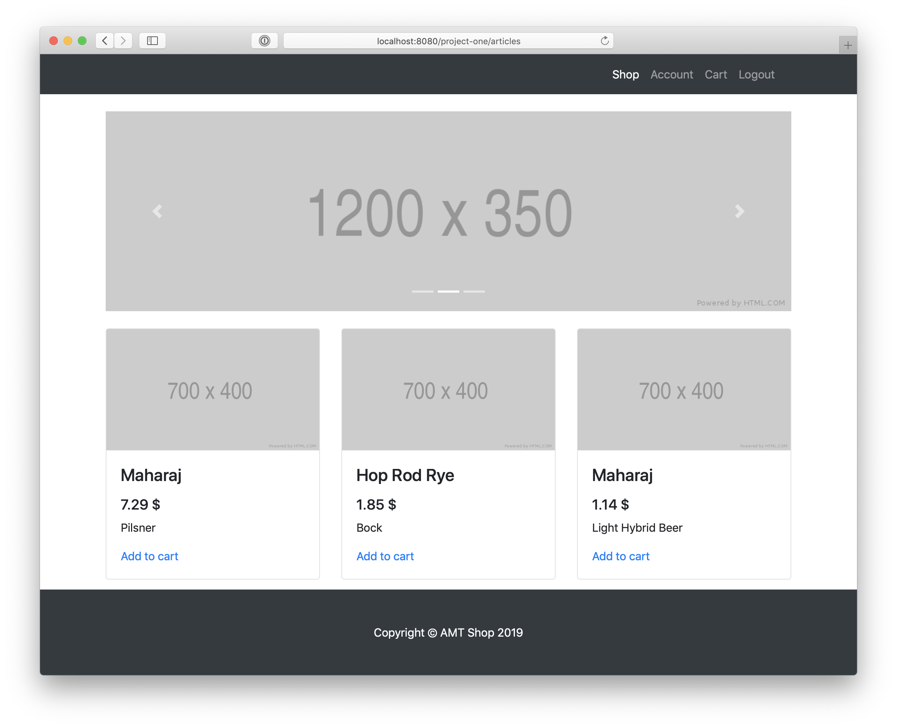
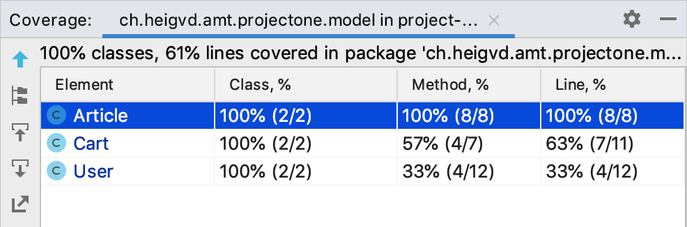
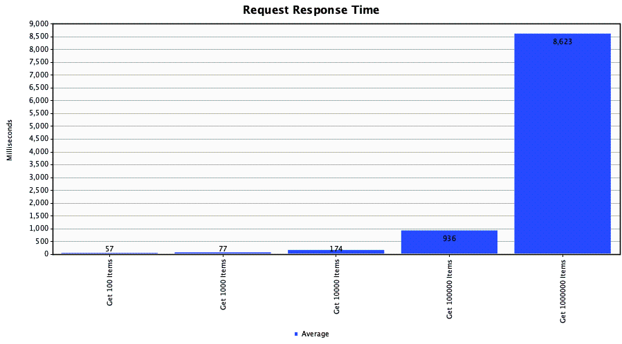
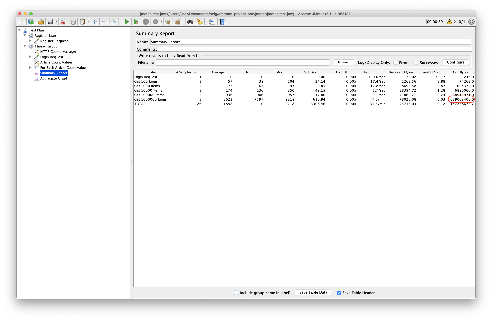
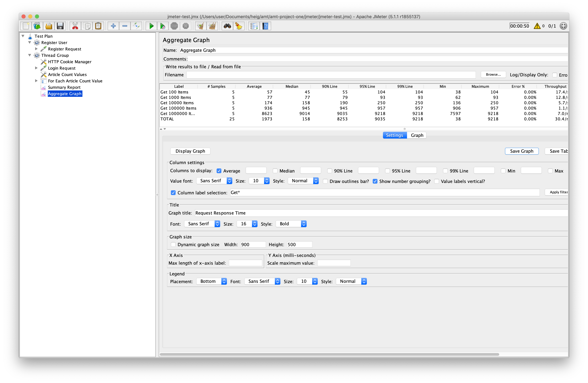

# AMT — Project One

* **Date:** 11.11.2019
* **Authors:** Nikolaos Garanis, Samuel Mettler.

## Introduction

For our project we have decided to build an online shop, where users can register and add or remove articles from their cart. Our model is composed of three classes: `User`, `Article` and `Cart`.





### Functionnalities

* A user can register.
* A user can login.
* A user can edit his account values.
* A user can add articles to his cart.
* A user can empty his cart.
* A user can logout.

### Architecture

#### Presentation tier

Our application uses multiple servlets (e.g. `LoginServlet`,`RegisterServlet`, `UserServlet`) which themselves use DAOs (e.g. `UserDaoLocal`, `ArticleDaoLocal`, `CartDaoLocal`) and/or services (e.g. `AuthenticationServiceLocal`, `GenerationServiceLocal`). The servlets will then send data to their corresponding JSP pages, which will be rendered into HTML pages.

We also have a servlet filter (`AuthenticationFilter`) which will intercept every request and check if the requested URL requires the user to be authenticated. If so, it then checks if the user is logged in to either redirect him to the login page or accept the request.

#### Database tier

The DAOs inject a datasource which represent a JDBC connection to an SQLite database. Wee have one DAO per model class and each of them provide CRUD operations for this classes  (create, read, update, delete).

#### Business tier

We possess two services, one to generate hash for passwords (`AuthenticationServiceLocal`) and the other one to generate random business data (`GenerationServiceLocal`), as described in more details below.

## Running the project

### Creating the database

After having cloned the repository, it is necessary to create the database. For this run the following commands:

```sh
cd db
./import.sh
```

This only creates the database structure and will not generate any data. We will see later how to do that. We use an SQLite database that is stored in the `db`. There is one for production (`database.sqlite`) and one for running tests (`database-test.sqlite`).

### Building the project

Our project uses Maven so the `war` can be generated using the following command:

```sh
mvn clean package -DskipTests=true
```

It is necessary to skip tests because they require an running instance of the application server. This is what we will do in our next step.

### Launching the application

We use Docker Compose to start the application server and handle its configuration. We have two topologies, one for production and one for running integration tests. We will see the second one later.

We first need to build the production topology by running the following commands:

```sh
cd docker/topologies/prod
docker-compose build
```

This will build the only service we have defined, which is the Wildfly application server. To launch it and have it deploy the `war` automatically, run the following command from the same directory:

```sh
docker-compose up
```

Once the server is up, the application can be accessed with the following URL: http://localhost:8080/project-one. To stop the server, run the following command:

```sh
docker-compose down
```

### Generating business data

Random business data can be generated from the application itself, this is done by accessing the following URL: http://localhost:8080/project-one/generate. One can then enter the number of entities to create and click *Generate*. If X entities are generated, this means X users will be generated (with the password `pwd`), along with X articles and, at most, 5X cart items. We have managed to generate 1 million entities (so around 4 millions entries in total) in around 1 minute 20 seconds.

Note 1: in order to have a fast insert time, we have used the following methods in our DAOs:

```java
Connection.setAutoCommit(false)
PreparedStatement.addBatch()
PreparedStatement.executeBatch()
Connection.commit()
```

We believe this prevents the `@Transactional(TransactionMode.ROLLBACK)` annotation from working correctly in the integration tests, so it is necessary that we clean up the created objects ourselves.

Note 2: Generation time is considerably slower when the server is running inside a Docker container. Around 6 minutes are needed to generate 1 million entities.

## Testing the project

We have written both unit tests for our model classes, as well as integration tests for our DAOs and services (with Arquillian), and servlets (with Mockito). All these tests can be run using Maven. However, because we have set up Arquillian to use a remote server (instead of an embedded or managed one), we must have a running Wildfly instance before launching the tests with Maven. To do this, we will use our Docker Compose test topology we mentionned above. This is done with the following commands (it is necessary that the ports 8080, 8787 and 9990 be available):

```sh
cd docker/topologies/test
docker-compose build
docker-compose up
```

Once the Wildfly instance is up, the Maven tests can be run using the following command (at the root of the project directory):

```sh
mvn clean test
```

### Unit tests

We have written unit tests for our models. As our model is quite simple, so are the tests. JUnit is used for the tests. Our most complete test class has been written for the `Article` model class our test coverage metrics is of 100%. The metrics for the two other model class is lower, but the `ArticleTest` provides a good example of the tests that could be written for the two other model classes.



### Arquillian tests

In order to test our EJBs (DAOs or services), we need to inject them into the corresponding test class, as they will themselves use other injected resources (e.g. the datasource). This is a problem because JUnit does not handle this by itself.

We must therefore use Arquillian which is a way of providing an application server to JUnit, for the application `war` to be deployed and for JUnit to properly execute the tests. In order to configure Arquillian, we created a `test/resources/arquillian.xml` file in which we describe the application server to be used by Arquillian. In our case, the server will be "remote", that means it will not be started and stopped by Arquillian. We must do it ourselves by another mean. We have use Docker Compose for this, as explained before.

Another tool we have used is Chameleon, which allows us to easily change the application server to be used by Arquillian. However, here we only use Wildfly.

Then, in our test class, let's take `UserJdbcDaoTest` as an example, we must use some additional annotations for JUnit to correctly execute the tests.

```java
// Tells JUnit to run the tests with Arquillian.
@RunWith(Arquillian.class)

// Provided by Chameleon, will execute Maven to build and deploy our project
// to the application server.
@MavenBuild
@DeploymentParameters(testable = true)
public class UserJdbcDaoTest {

    // The injected EJB we want to test.
    @EJB
    private UserDaoLocal userDao;

    ...
}
```

Note: in order to have test coverage metrics we need to use another plugin, it is not handled by Arquillian alone. We have not used such a plugin so we have no metrics to provide. It should also be noted that using Arquillian is slower, because the project must be compiled using Maven and then deployed on an application server which must be started.

### Mockito

When testing our servlets, we don't need to have real instances of the classes used by it (such as the HTTP request and response objects, as well as any DAO or service). This eliminates the need to run the test in a running application server. Instead, we can just mock these different components and test if the wanted methods are called or not. These mean that what we are testing here is closer to the logic or "execution flow" of the servlet's methods.

Mockito is a tool that allows to do exactly that, therefore we have used it to write our servlet tests. The `GenerateServletTest` gives use an example of how to use Mockito, and for this class we have a test coverage metrics of 100%.

### Pagination performance test

We have also design a simple JMeter test in order to compare the average response time when requesting the article page with a different number of articles displayed on the page. First, we register a user (i.e. admin/admin) using a POST request. We do another POST request to log in this user. Then, for each of our defined article count values (i.e. 100, 1000, 10,000, 100,000, 1,000,000) we perform a defined number of GET requests (currently 5) to the following URL: `/articles?pageNumber=1&articleCount=${articleCount}`. We then graph the average response time for each request group. Here is the result graph:



We can clearly see the importance of using pagination when our database contains a high number of items. If we didn't have pagination, the user would have to wait around 9 seconds each time for the response to be received. This exclude the time it would take the render the HTML page. In the *Summary Report*, we can see that the last request has a size of 689MB, which would probably crash the browser during rendering. This is of course not acceptable.



Our JMeter test can be found in the `jmeter` directory. Also, probably because of a bug in this software, we have not managed to save the settings of the *Aggregate Graph* so we display them bellow:

