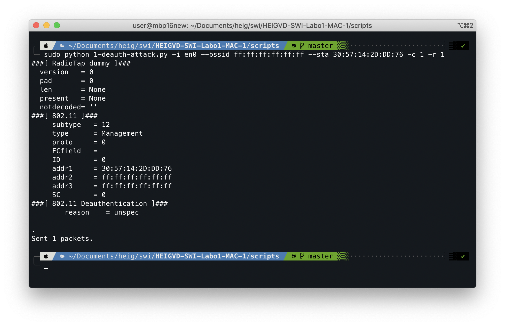
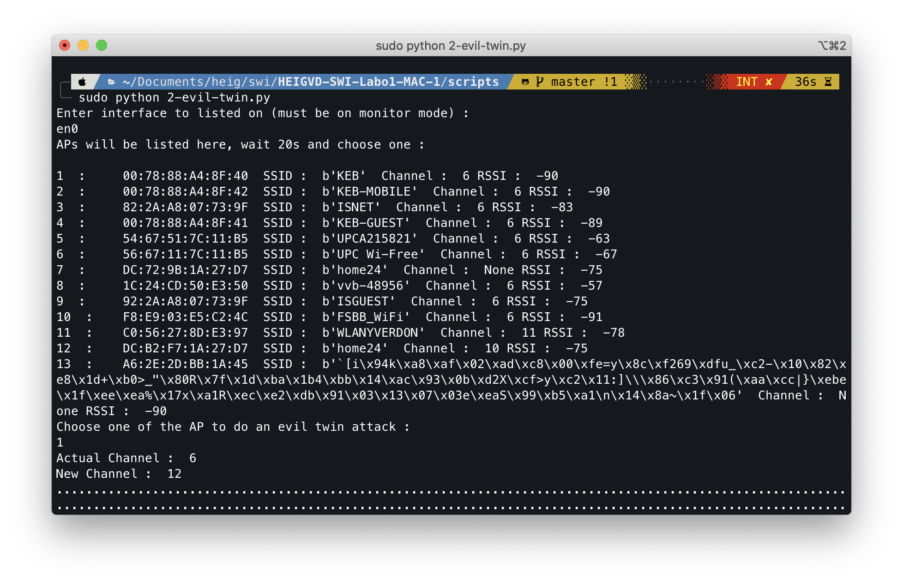
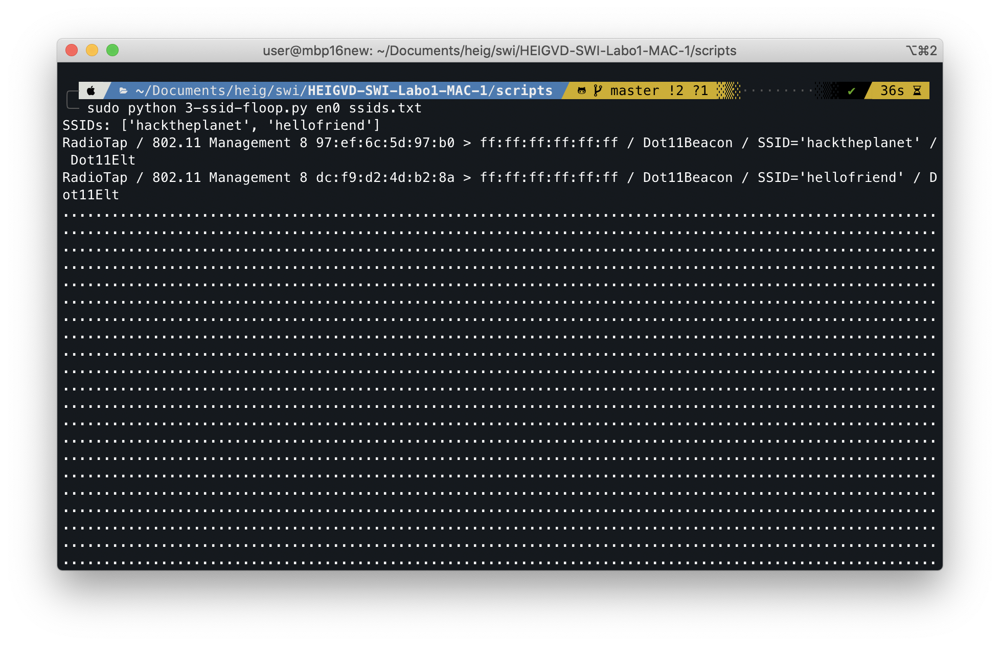
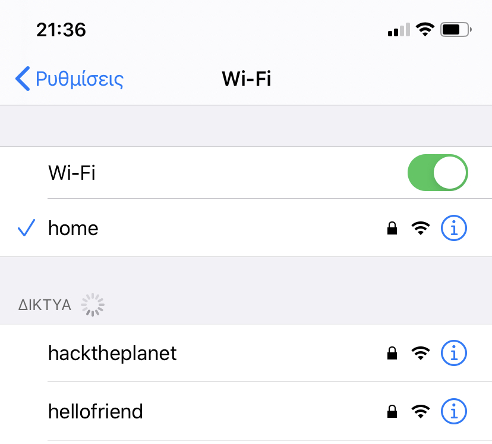

# SWI — Laboratoire 1

* **Date** : 09.03.2020
* **Auteurs** : Mickael Bonjour, Nikolaos Garanis.

## 1. Deauthentication attack

> Quel code est utilisé par aircrack pour déauthentifier un client 802.11. Quelle est son interpretation ?

Le code utilisé est le 7 « Class 3 frame received from nonassociated station ». Une frame de classe 3 est envoyée lors de l'état 3, c'est-à-dire lorsqu'une station a été associée et authentifiée. On a donc une telle frame mais reçue par une station non-associée (probablement car la station se déconnecte d'abord puis en informe l'AP).

[Source](https://flylib.com/books/en/2.519.1/frame_transmission_and_association_and_authentication_states.html)

> À l'aide d'un filtre d'affichage, essayer de trouver d'autres trames de déauthentification dans votre capture. Avez-vous en trouvé d'autres ? Si oui, quel code contient-elle et quelle est son interpretation ?

Avec Wireshark on peut utiliser le filtre suivant: `(wlan.fc.type eq 0) && (wlan.fc.type_subtype eq 12)`. On a trouvé les codes 3 (désassociation volontairement de la station) et 4 (station déconnectée par l'AP pour inactivité).

> Quels codes/raisons justifient l'envoie de la trame à la STA cible et pourquoi ?

Les codes 1, 4 et 5.

* Le code 1 (Unspecified) fonctionne dans les deux sens, la raison est inconnue.
* Le code 4 informe la station qu'elle a été déconnectée par l'AP à cause de son inactivité.
* Le code 5 informe la station qu'elle a été déconnectée par l'AP parce que ce dernier est "incapable de gérer toutes les stations connectées".

> Quels codes/raisons justifient l'envoie de la trame à l'AP et pourquoi ?

Les codes 1 et 8. D'après le message du code 8 (*Disassociated because sending station is leaving (or has left) BSS*), il est clair que c'est la station qui informe l'AP qu'elle a quitté le réseau.

> Comment essayer de déauthentifier toutes les STA ?

Mettre en adresse cible client (pour les codes 1, 4 et 5) l'adresse broadcast, i.e. FF:FF:FF:FF:FF:FF.

> Quelle est la différence entre le code 3 et le code 8 de la liste ?

D'après cette [spécification](https://www.iith.ac.in/~tbr/teaching/docs/802.11-2007.pdf), le code 3 annonce une déauthentification alors que le code 8 annonce une désassociation.

> Expliquer l'effet de cette attaque sur la cible.

La cible va être déconnectée du réseau Wifi, il est ainsi possible d'effectuer un déni de service en effectuant continuellement cette attaque (la cible ne restera jamais connectée au WiFi assez longtemps pour pouvoir profiter du service).

### Exemple du script

## 2. Fake channel evil tween attack

> Expliquer l'effet de cette attaque sur la cible

Si la cible est déjà connectée à un réseau, cette attaque n'aura probablement pas d'effet. Par contre, si la cible est déconnectée de ce réseau (par exemple avec l'attaque 1), elle pourra être amenée à se connectée au réseau malicieux.

### Exemple du script

## 3. SSID flood attack

### Exemple du script

