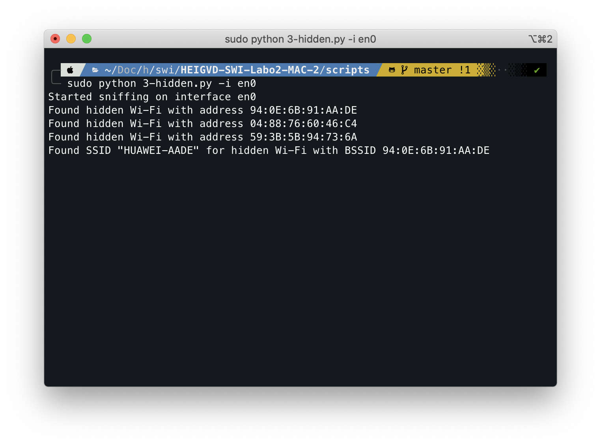

# SWI – Laboratoire 2

* **Date** : 16.03.2020
* **Auteurs** : Mickael Bonjour, Nikolaos Garanis.

## 1. Probe Request Evil Twin Attack

> Comment ça se fait que ces trames puissent être lues par tout le monde ? Ne serait-il pas plus judicieux de les chiffrer ?

Ces probes sont lancées pour essayer de trouver un WiFi, l'appareil n'est pas connecté à ce moment là. Cela implique qu'il n'y a pas de clé établie entre l'AP et l'appareil pour chiffrer.

> Pourquoi les dispositifs iOS et Android récents ne peuvent-ils plus être tracés avec cette méthode ?

Car lorsqu'ils cherche un Wifi auquel se connecter (probe request), l'adresse MAC de la frame est randomisée. Il n'est donc plus possible d'associer les probe requests à un appareil spécifique.

### Fonctionnement

## 2. Détection de clients et réseaux

### Fonctionnement

## 3. Hidden SSID reveal

> Expliquer en quelques mots la solution que vous avez trouvée pour ce problème.

Nous commençons par enregistrer les BSSID qui émettent des beacons sans y indiquer un SSID spécifique, cela nous indique les Wifis cachés. En même temps, on récupère les trames *probe response* car c'est là que les Wifis indiquent leur SSID aux appareils qui le recherchent (c'est-à-dire qui ont envoyé une trame *probe request*). On fait ensuite correspondre le SSID trouvé dans les *probe response* aux beacons via l'adresse BSSID.

### Fonctionnement

