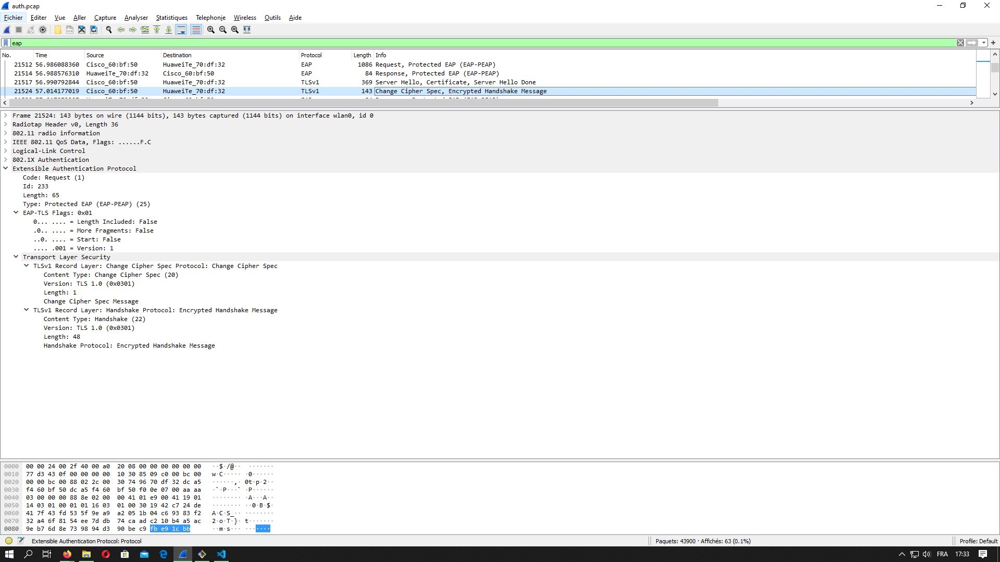

# Rapport Labo 6 SWI
### Auteurs : Mickael Bonjour & Nikolaos Garanis

### Analyse d’une authentification WPA Entreprise

#### Requête et réponse d’authentification système ouvert
Nous avons vu que dans la capture Wireshark qu'il y avait 2 authentifications EAP en mettant le filtre "eap". Nous nous sommes dirigés vers la première et avons enlevé le filtre pour voir les trames d'authentification ouvertes :

#### Requête et réponse d’association (ou reassociation)
On voit la réassociation à la suite de l'authentification :

#### Négociation de la méthode d’authentification entreprise
L'on voit que l'AP envoie une demande EAP-TLS :

Que le client répond avec un legacy NaK pour demander à passer sur du EAP-PEAP :

Que le serveur approuve en renvoyant la confirmation EAP-PEAP :

#### Phase d’initiation. Arrivez-vous à voir l’identité du client ?
En remettant le filtre l'on voit rapidement le request/response :

L'on voit que l'identité est affichée en tant que Joel Gonin.
#### Phase hello :
Client Hello indique déjà les paramètres qui sont disponibles pour l'utilisateur :

Le Server Hello confirme et choisi les paramètres :

* Version TLS -> Le client a proposé la version 1.2 mais le serveur a choisi la version 1.0
* Suites cryptographiques et méthodes de compression proposées par le client et acceptées par l’AP -> Le client a envoyé 32 suites qui étaient à sa disposition et le serveur en a choisi une : TLS_RSA_WITH_AES_256_CBC_SHA
* Nonces -> Mis en évidence dans les captures (Random).
* Session ID -> Mis en évidence dans les captures
#### Phase de transmission de certificats
* Echanges des certificats -> Mis en évidence dans la capture précédente (Server Hello). L'on voit que le serveur envoit sa chaîne de certificats (3 certificats).
* Change cipher spec

#### Authentification interne et transmission de la clé WPA (échange chiffré, vu comme « Application data »)
On peut voir ici les différents paquets Application Data chiffrés :

L'on voit que cela correspond au nombre de paquets pour faire l'authentification interne comme présenté en cours.
#### 4-way handshake
L'on peut voir le 4 way handshake après le Success de EAP, grâce au filtre EAPOL :

## Répondez aux questions suivantes :
 
> **_Question :_** Quelle ou quelles méthode(s) d’authentification est/sont proposé(s) au client ?
> 
> **_Réponse :_** EAP-TLS uniquement, c'est le client qui demande à repasser sur EAP-PEAP.

---

> **_Question:_** Quelle méthode d’authentification est finalement utilisée ?
> 
> **_Réponse:_** EAP-PEAP selon le choix du client.

---

> **_Question:_** Lors de l’échange de certificats entre le serveur d’authentification et le client :
> 
> - a. Le serveur envoie-t-il un certificat au client ? Pourquoi oui ou non ?
> 
> **_Réponse:_** Oui le serveur envoit sa chaîne de certificat au client. Permet d'éviter les MITM, typiquement lorsque l'on fait des evils twins. Cela permet au client de s'assurer qu'il dialogue avec la bonne entité afin de ne pas envoyé ses identifiants à n'importe qui.
> 
> - b. Le client envoie-t-il un certificat au serveur ? Pourquoi oui ou non ?
> 
> **_Réponse:_** Non, le client a demandé une authentification PEAP, c'est à dire via ses identifiants. Ainsi il n'a pas besoin de prouver son identité via un certificat comme ce serait le cas avec EAP-TLS.
> 

---