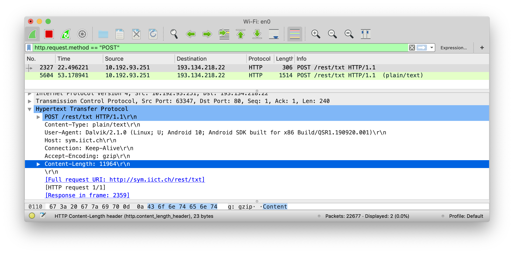
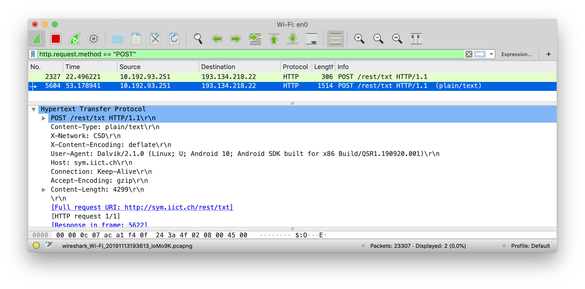

# SYM — Rapport du Laboratoire 2

* **Date** : 13/11/2019
* **Auteurs** : Mickael Bonjour, Nikolaos Garanis et Samuel Mettler.

## Traitement des erreurs

> **Que se passe-t-il si le serveur n’est pas joignable dans l’immédiat ou s’il retourne un code HTTP d’erreur ?**

Si le serveur n'est pas joignable une SocketTimeoutException est lancée et son message d'erreur est affiché à l'utilisateur à la place de la réponse attendue du serveur. Dans le cas ou la réponse du serveur retourne un code HTTP d'erreur, nous lançons une IOException avec le code d'erreur retourné. Ce message d'erreur est aussi affiché à l'utilisateur.

> **Veuillez proposer une nouvelle version, mieux adaptée, de ces deux classes / interfaces pour vous aider à illustrer votre réponse.**

Dans notre nouvelle version, nous avons changé la déclaration de la classe DownloadTask comme indiqué ci-dessous, et nous avons créé les classes `Request` et `Response`. Cela nous permet d'avoir dans la réponse un champ dédié à une éventuelle exception qui a été levée. Dans l'UI il suffit donc de vérifier la valeur de ce champ pour gérer l'erreur d'une autre manière.

```java
// avant
private static class DownloadTask extends AsyncTask<String, Integer, String> {

// après
private static class DownloadTask extends AsyncTask<Request, Integer, Response> {
```

```java
public class Request {
    private String body;
    private String mimeType;
    private URL endpoint;
    private boolean shouldCompress;
}
```

```java
public class Response {
    private Exception error;
    private Object body;
}
```

## Authentification

> **Si une authentification par le serveur est requise, peut-on utiliser un protocole asynchrone ? Quelles seraient les restrictions ? Peut-on utiliser une transmission différée ?**

Si une authentification est requise, il est nécessaire que les identifiants ou un token d'authentification aient été préalablement entré par l'utilisateur, afin qu'ils puissent être utilisés par la requête asynchrone. Une restriction serait, par exemple, l'utilisation de systèmes d'authentification 2FA qui demande l'entrée d'un code unique au moment de la requête.

Cela vaut aussi pour la transmission différée, cependant une restriction supplémentaire apparaît : dans le cas d'un token, il est possible que la session de l'utilisateur ait expiré, puisqu'on ne peut pas savoir quand la requête va être faite.

## Threads concurrents

> **Lors de l'utilisation de protocoles asynchrones, c'est généralement deux threads différents qui se préoccupent de la préparation, de l'envoi, de la réception et du traitement des données. Quels problèmes cela peut-il poser ?**

Comment savoir à quelle requête une réponse reçue correspond (si besoin). Cela serait problématique dans le cas où un thread s'occupe d'envoyer et l'autre e recevoir par exemple.

L'état des ressources partagées qui changent à un moment de préemption de threads par exemple. On pourrait se retrouver avec une requête non conforme à envoyer par exemple ou bien une réponse pas tout à fait complète, typiquement lors de la réception si l'on affiche le résultat de la requête sans attendre que le Thread ait tout lu.

## Écriture différée

> **Lorsque l'on implémente l'écriture différée, il arrive que l'on ait soudainement plusieurs transmissions en attente qui deviennent possibles simultanément. Comment implémenter proprement cette situation (sans réalisation pratique) ? Voici deux possibilités :**

### Une connexion par transmission différée

Cette implémentation est celle actuellement utilisée : lorsqu'une connexion réseau n'est pas disponible, les requêtes sont mises dans une liste puis, lorsque la connexion est retrouvée, les requêtes sont lancées (`SymComManager.sendRequest()`) de manière synchrone mais elles sont exécutées (`DownloadTask` qui étend `AsyncTask`) de manière asynchrone. Le handler défini est ensuite appelé pour chaque réponse reçu (l'ordre d'arrivée n'est donc pas prévisible).

### Multiplexage de connexions en une seule connexion de transport

> **Comment implémenter le protocole applicatif, quels avantages peut-on espérer de ce multiplexage, comment doit-on planifier les réponses du serveur lorsque ces dernières s'avèrent nécessaires ?**

Il serait possible de grouper les requêtes par hostname. Ensuite, pour chaque hostname, on ouvre une connexion et on effectue toutes les requêtes en même temps.

## Transmission d'objets
### A

> **Quel inconvénient y a-t-il à utiliser une infrastructure de type REST/JSON n'offrant aucun service de validation (DTD, XML-schéma, WSDL) par rapport à une infrastructure comme SOAP offrant ces possibilités ?**

Le désavantage est le fait que n'ayant aucune validation les objets pourraient être mal formatés et incompréhensibles rendant impossible leur parsage, ou nous obligeant à vérifier la présence de chaque champs. On ne pourra pas avoir d'erreurs précises et claires de ce qui ne va pas.

> **Est-ce qu’il y a en revanche des avantages que vous pouvez citer ?**

L'avantage cependant est la liberté (flexibilité) que l'on peut prendre et ainsi créer des objets peut-être plus complexes sans être limités. Il est aussi possible de recevoir des objets avec une structure complètement différente. De plus, JSON est plus concis et plus facilement lisible par un humain que XML.

### B

> **L’utilisation d’un mécanisme comme Protocol Buffers est-elle compatible avec une architecture basée sur HTTP ?**

Oui, PB est compatible avec HTTP. PB fournit un language afin de décrire la structure de nos objets ([exemple](https://developers.google.com/protocol-buffers/docs/javatutorial#defining-your-protocol-format)) et une librairie permettant de produire le code source (plusieurs languages supportés) nécessaire à la sérialisation et désérialisation des objets décrits ([compilation](https://developers.google.com/protocol-buffers/docs/javatutorial#compiling-your-protocol-buffers), [code généré](https://developers.google.com/protocol-buffers/docs/javatutorial#the-protocol-buffer-api)). Lors de la sérialisation de nos objets, le résultat ([au format binaire](https://developers.google.com/protocol-buffers/docs/encoding)) peut être écrit dans un stream (comme celui d'une requête `HttpUrlConnection` ; [example à l'avant-dernière ligne du code](https://developers.google.com/protocol-buffers/docs/javatutorial#writing-a-message)). Idem, lors de la déserialisation, la sérialisation peut être lue du stream afin d'être désérialisée. Il peut cependant être nécessaire de préciser le Content-Type de la requête HTTP (e.g. `application/octet-stream `, `application/x-protobuf ` ; [source](https://stackoverflow.com/a/1425984/5536516)).

> **Veuillez discuter des éventuelles avantages ou limitations par rapport à un protocole basé sur JSON ou XML.**

Google [cite](https://developers.google.com/protocol-buffers/docs/overview#whynotxml) plusieurs avantages par rapport à XML :

* la taille d'un object sérialisé (3 à 10 fois plus petite),
* la vitesse de sérialisation et désérialisation (20 à 100 plus rapide),
* la portabilité (Google supporte la même API à travers plusieurs languages de programmation).

Cependant, bien que Google évoque une simplicité d'utilisation, nous pensons que PB demande un certain temps d'apprentissage et de configuration (intégration à un projet existant). Temps qui ne vaut peut être pas la peine pour certaines applications simples (et ou l'utilisation de JSON sera plus rapide).

### C

> **Par rapport à l’API GraphQL mise à disposition pour ce laboratoire. Avez-vous constaté des points qui pourraient être améliorés pour une utilisation mobile ? Veuillez en discuter, vous pouvez élargir votre réflexion à une problématique plus large que la manipulation effectuée.**

L'API GraphQL mise à disposition nous permet de faire des requêtes afin d'obtenir diverses informations sur les auteurs et leur(s) article(s). Cependant, pendant l'implémentation de cette solution on a vu que ce que nous renvoyait l'API était un JSON. Ceci peut être une bonne chose mais dans notre cas cela nous a forcé une implémentation assez lourde pour pouvoir traiter les réponses alors qu'en soit les données envoyées n'étaient pas spécialement complexe : Pour l'auteur, ce qui nous intéresse est son nom, son prénom et son ID tandis que pour les messages, ce qui nous intéresse est le titre et le contenu (on a décidé arbitrairement de ne pas traiter la description).

Le fait que la réponse soit un JSON nous force à faire plusieurs opérations différentes avant de pouvoir mapper la solution dans notre spinner en raison du format demandé par le spinner. Cela signifie qu'en fonction de l'élément dans lequel on a besoin des informations de l'API on va devoir faire différents traitements sur la réponse. Dans notre cas on en a que 2 (un pour un spinner et l'autre dans un textview), mais dans le cas où on souhaiterait utiliser cette API avec plein de modules différents cela forcerait autant d'implémentations différentes que de modules ce qui peut devenir très lourd.

Ce qui pourrait être bien serait d'avoir des fonctions adaptés au module nécessitant la réponse de l'API afin d'envoyer dans le format qui convient (tableau de string pour un spinner, string pour textview, …) en rajoutant un paramètre dans la requête par exemple (responseType).

## Transmission compressée

> **Quel gain peut-on constater en moyenne sur des fichiers texte (xml et json sont aussi du texte) en utilisant la compression du point 3.4 ? Vous comparerez plusieurs tailles et types de contenu.**





Comme on peut le voir, la taille de la requête a été plus que divisé par 2 (de 11964 bytes à 4299). Le contenu de la requête est le texte de [cette](https://www.chipestimate.com/Unzipping-the-GZIP-compression-protocol/Altior/Technical-Article/2010/03/23) page web. Nous n'avons pas essayé avec des types de contenu différents, mais pour les images, vidéos et autres format multimedia, le ratio de compression sera très probablement beaucoup moins élevé, ces formats utilisant déjà des méthodes de compression (qui en plus sont *lossy* contrairement à deflate qui est *lossless*).
