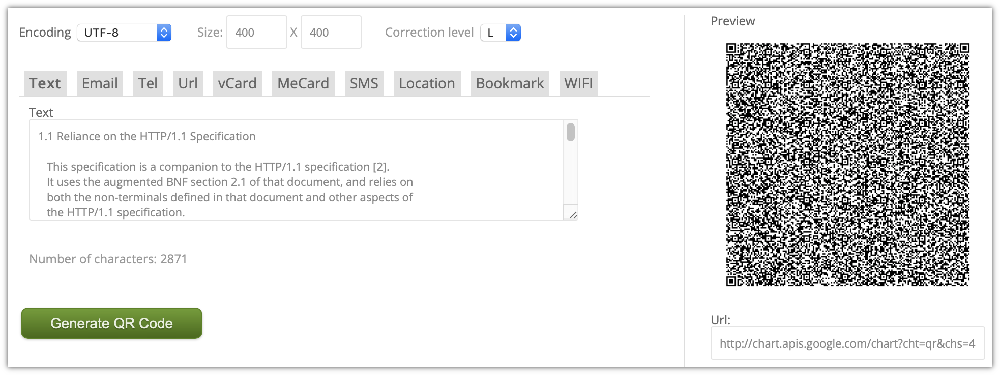
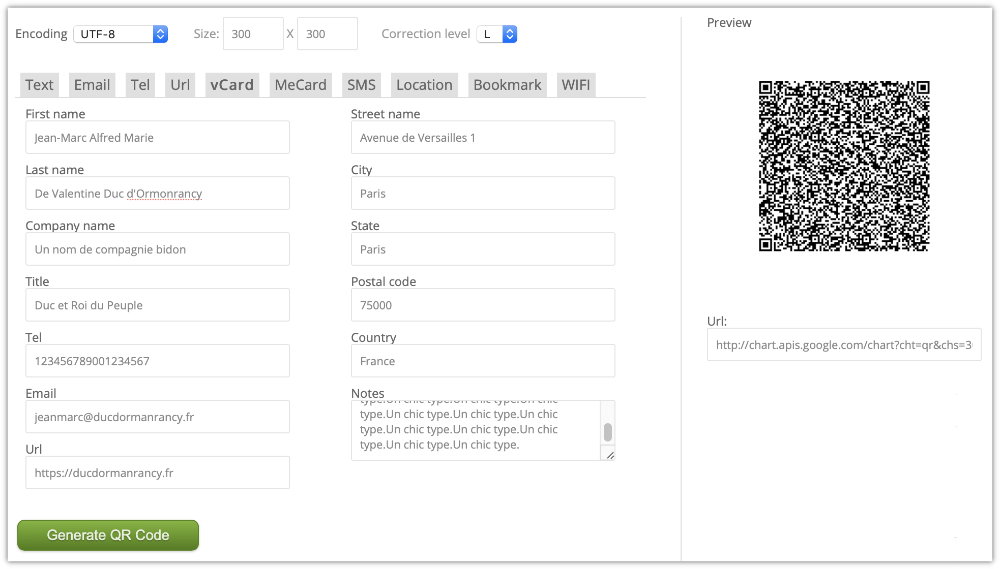

# Laboratoire 3 — Codes-barres et NFC

* **Date** : 22.11.2019
* **Auteurs** : Mickael Bonjour, Nikolaos Garanis, Samuel Mettler.

## Questions NFC

> 1. Dans la manipulation ci-dessus, les tags NFC utilisés contiennent 4 valeurs textuelles codées en UTF-8 dans un format de message NDEF. Une personne malveillante ayant accès au porte- clés peut aisément copier les valeurs stockées dans celui-ci et les répliquer sur une autre puce NFC. 
>
>    A partir de l’API Android concernant les tags NFC, pouvez-vous imaginer une autre approche pour rendre plus compliqué le clonage des tags NFC ? Existe-il des limitations ? Voyez-vous d’autres possibilités ? 
>

Afin de rendre plus compliqué les clonages des tags NFC il existe une petite manière de rendre le clonage difficile. En effet depuis l'API des tags on peut voir que la méthode `getTechList()` retourne tous les technologies utilisées sur le TAG. Il existe une technologie appelé `MifareClassic` qui nécessite une authentification avant d'autorisé de faire des opérations I/O. Cependant il est important de noter que cette implémentation ne suffit pas car il est très facile de bruteforce cette authentification.  
Il y a évidemment d'autre possibilité comme celle employé par les cartes de paiement moderne (EMV) qui utilisent un clé asymétrique qui ne peut pas être extrait de la carte. Cette clé fournit la possibilité de signer des challenges chiffrés. Ces implémentations se basent sur Java Card.
 
> 2. Est-ce qu’une solution basée sur la vérification de la présence d’un iBeacon sur l’utilisateur, par exemple sous la forme d’un porte-clés serait préférable ? Veuillez en discuter.  

Le problème avec cette solution est basé sur l'implémentation elle même des iBeacons. Tout réside sur le fait qu'il faut identifier avec précision la position du beacon. Comme la diffusion ce fait sous forme de cercle autour de la cible ceci peut donner les problèmes suivants : Alice veut rentrer dans un bâtiment et la porte nécessite de détecter un iBeacon pour entrer. Alice passe la porte et la referme derrière elle, rien n'empêche à Bob d'entrer sans posséder de iBeacon car le iBeacon d'Alice est toujours détecter par la porte. 

…

## Questions Codes-barres

> 1. Quelle est la quantité maximale de données pouvant être stockée sur un QR-code ? Veuillez expérimenter, avec le générateur conseillé de codes-barres (QR), de générer différentes tailles de QR-codes. Pensez-vous qu’il est envisageable d’utiliser confortablement des QR- codes complexes (par exemple du contenant >500 caractères de texte ou une vCard très complète) ? 

Un QR-code de version maximale, c'est-à-dire 40, dispose de $(4 \times 40 + 17)^2$ modules, soit  31'329 (un module étant un « pixel » du QR-code). Tous ces modules ne peuvent être utilisés ; par exemple, certains le sont automatiquement pour la correction d'erreur.

En utilisant un niveau de correction d'erreur minimum (Low), un QR-code de version 40 nous permet de stocker 2'953 octets. Cependant, si l'on ne veut stocker que des chiffres, ou bien que des caractères alphanumériques, la limite est de 7'089 chiffres (ou 4'296 caractères alphanumériques). Cela est possible car le jeu de caractères utilisé est plus petit (moins de bits nécessaire pour codé un caractère). [source](https://www.qrcode.com/en/about/version.html)

Plus la quantité d'information, par exemple dans une vCard, est élevée, plus le QR-code sera difficile à lire (du au grand nombre de modules et à la taille limitée de l'image). Cela empire si l'environnement n'est pas favorable : QR-code à distance et/ou endommagé, peu de temps pour effectuer le scan, etc.

Nous avons aussi essayer de stocker un texte de 2800 caractères dans un QR-code et afin qu'il soit scanné, une taille minimum était requise (400 x 400 pixels), sinon le scan échouait.

Il n'est donc pas envisageable de stocker une grande quantité d'information dans un QR-code afin que ceux-ci soit **confortablement** utilisés.

> 2. Il existe de très nombreux services sur Internet permettant de générer des QR-codes dynamiques. Veuillez expliquer ce que sont les QR-codes dynamiques. Quels sont les avantages et respectivement les inconvénients à utiliser ceux-ci en comparaison avec des QR-codes statiques. Vous adapterez votre réponse à une utilisation depuis une plateforme mobile.

Un QR-code « dynamique » est un QR-code qui pointe vers une URL, ce vers quoi l'URL pointe pouvant être modifié. C'est un service qui fourni l'URL qui sera mise dans le QR-code et c'est aussi à travers le service qu'on peut dire vers quoi pointe l'URL. Exemple avec le service [uqr.me](https://uqr.me) où nous avons pu faire pointer le même QR-code vers deux vCard différentes (successivement).

Lorsque nous scannons le QR-code, on nous propose d'ouvrir l'URL « uqr.to » ([https://uqr.to/gso4](https://uqr.to/gso4) pour être exact).

Lorsque nous visitons l'URL proposée, nous sommes redirigé vers le site du service qui nous propose de télécharger la vCard de Jack.

Ensuite, nous modifions la vCard et après avoir rescanné le QR-code, la vCard de Jean est proposée.

La possibilité de pouvoir modifier le contenu vers lequel va pointer l'URL du QR-code est un avantage évident. De plus, le service propose différents types de contenu, e.g. adresse Google Maps, téléchargement de fichier, vidéo Youtube, contact Whatsapp ; avec une ouverture automatique de l'application mobile correspondante. Le service propose aussi des statistiques nous permettant de savoir combien de personnes ont scanné notre QR-code.

Le désavantage de ce type de QR-code est qu'il repose sur l'existence d'un service. Si celui-ci disparaît (très possible s'il est gratuit) alors tous les QR-code créés avec deviendront invalides.